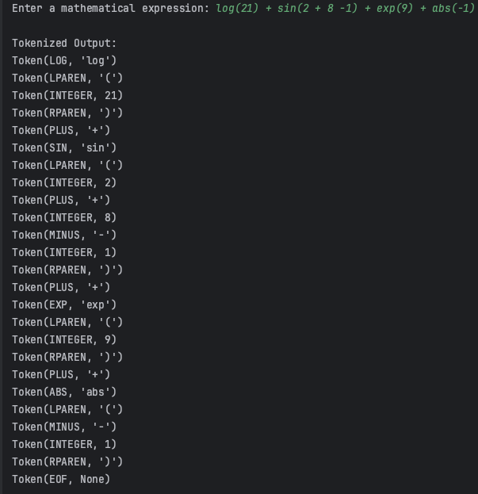
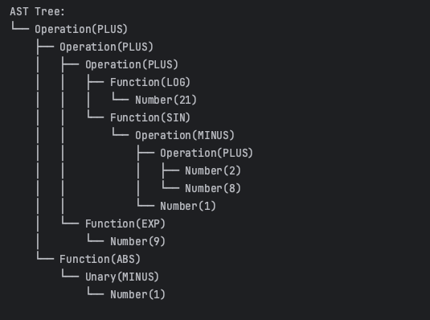

# Laboratory work nr. 6 - Parser & Building an Abstract Syntax Tree
### Course: Formal Languages & Finite Automata
### Author: Rateeva Daria

----

## Theory: Parser and Abstract Syntax Tree (AST)

### Parsing

Parsing is a fundamental step in the compilation or interpretation process of programming languages. It refers to the process of analyzing a sequence of input symbols (typically tokens generated by a lexical analyzer) to determine their syntactic structure with respect to a given formal grammar.

The goal of parsing is to generate a structured representation of the input — often in the form of a tree — that reflects the hierarchical organization of expressions and statements. This structured form is essential for further processing stages such as semantic analysis or code generation.

There are two main types of parsing techniques:
- **Top-Down Parsing**: Begins with the start symbol of the grammar and attempts to rewrite it into the input string. A well-known example is the **Recursive Descent Parser**, where the grammar rules are implemented as recursive functions. This approach is relatively easy to implement and works well with simple, unambiguous grammars.
- **Bottom-Up Parsing**: Starts from the input string and attempts to reduce it to the start symbol by identifying right-hand sides of grammar rules. This method is more powerful and can handle more complex grammars, but it is harder to implement manually.

In this laboratory task, we use a **Recursive Descent Parser**. Each non-terminal in the grammar is represented by a method or function, and parsing proceeds by calling these methods in a structured manner that mirrors the grammar rules. It is especially suited for arithmetic expressions, where precedence and associativity of operators must be carefully handled.

### Abstract Syntax Tree (AST)

An **Abstract Syntax Tree (AST)** is a tree-based representation of the abstract syntactic structure of source code or mathematical expressions. Unlike a full parse tree, which includes every detail of the grammar (such as parentheses or keywords), an AST captures only the core, meaningful elements of the input in a hierarchical format.

Each node in an AST represents a construct:
- **Literal values** (numbers, constants) are represented as leaf nodes.
- **Unary operations** (e.g., `-x`, `+x`) are represented as a node with a single child.
- **Binary operations** (e.g., `x + y`, `a * b`) are represented as nodes with two children: the left and right operands.
- **Function calls** (e.g., `sin(x)`, `log(21)`) are represented as nodes with one or more children representing arguments.

The AST serves several important roles:
- It simplifies the syntax structure by removing unnecessary syntactic clutter.
- It allows for easier **evaluation**, **translation**, and **optimization** of code.
- It is often the starting point for **semantic checks** and **code generation** in compilers.

In this laboratory work, we parse expressions that include basic arithmetic operations and standard mathematical functions like `sin`, `cos`, `log`, and `abs`. We then generate an AST to represent their structure. Finally, we visualize the AST using a tree-drawing technique that mimics how compilers internally process and visualize expressions.

This combination of parsing and AST construction helps deepen the understanding of how programming languages and expression evaluators interpret and process input in a structured and meaningful way.

---

## Objectives

The main goals of this laboratory work are as follows:

- **Understand the concept of parsing**: Learn what parsing is and how it can be implemented programmatically to analyze the syntactic structure of input expressions.
- **Get familiar with Abstract Syntax Trees (ASTs)**: Explore what ASTs are, how they represent the hierarchical structure of expressions, and how they are used in compilers and interpreters.

In addition to the work done in the previous (3rd) lab, this laboratory task requires the following implementations:

- **Token categorization**: If not already implemented, define a type called `TokenType` (e.g., as an `enum` or class) to categorize all possible tokens generated during lexical analysis.
- **Regular expression usage**: Apply regular expressions in the lexical analyzer to efficiently identify and categorize tokens such as numbers, operators, functions, and parentheses.
- **AST data structures**: Design and implement the necessary data structures (e.g., nodes for numbers, binary/unary operations, and functions) for constructing an Abstract Syntax Tree.
- **Parser implementation**: Develop a simple parser that consumes a list of tokens and constructs an AST that reflects the syntactic structure of the input expression.

---
## Implementation Details

The implemented lexer is designed to perform lexical analysis on mathematical expressions by identifying and categorizing meaningful components into tokens. It processes an input string character by character, extracts valid lexemes, and assigns them appropriate token types based on predefined rules.

This implementation supports integer and floating-point numbers, arithmetic operators, trigonometric and mathematical functions, as well as constants such as `pi` and `e`. Additionally, it handles parentheses for expression grouping and ensures that invalid characters are correctly flagged as errors.

The lexer consists of multiple components:
- A **token module** that defines token types and structures.
- A **lexer module** that processes input text and generates a sequence of tokens.
- A **main module** that provides an interface for users to input expressions and view tokenized output.

The following sections describe the functionality and structure of each component in detail.

## **1.Token module explanation**

### **1.1 tokens.py - TokenType Class**
```python
class TokenType:
    INTEGER = "INTEGER"
    FLOAT = "FLOAT"
    PLUS = "PLUS"
    MINUS = "MINUS"
    MULTIPLY = "MULTIPLY"
    DIVIDE = "DIVIDE"
    MODULO = "MODULO"
    EXPONENT = "EXPONENT"
    FACTORIAL = "FACTORIAL"
    LPAREN = "LPAREN"
    RPAREN = "RPAREN"
    SIN = "SIN"
    COS = "COS"
    TAN = "TAN"
    LOG = "LOG"
    SQRT = "SQRT"
    EXP = "EXP"
    ABS = "ABS"
    POW = "POW"
    PI = "PI"
    E = "E"
    EOF = "EOF"
    INVALID = "INVALID"

```
**Explanation**:  
This code defines a **TokenType** class that serves as an enumeration for different token categories in lexical analysis. Each class variable represents a specific type of token that the lexer can recognize and process.

- **Arithmetic Operators**: `PLUS`, `MINUS`, `MULTIPLY`, `DIVIDE`, `MODULO`, `EXPONENT`, `FACTORIAL` represent basic mathematical operations.
- **Parentheses**: `LPAREN` and `RPAREN` are used to group expressions.
- **Functions**: `SIN`, `COS`, `TAN`, `LOG`, `SQRT`, `EXP`, `ABS`, and `POW` represent mathematical and trigonometric functions.
- **Constants**: `PI` and `E` represent the mathematical constants π and Euler’s number.
- **Number Types**: `INTEGER` and `FLOAT` distinguish between whole numbers and decimal numbers.
- **EOF (End of File)**: `EOF` signifies the end of the input stream.
- **INVALID**: `INVALID` is used to identify unrecognized characters.

This classification enables the lexer to efficiently process input expressions by recognizing and categorizing each component accordingly.

---

### **1.2 tokens.py - Token Class**
```python
class Token:
    def __init__(self, type_, value=None):
        self.type = type_
        self.value = value

    def __repr__(self):
        return f"Token({self.type}, {repr(self.value)})"

```
**Explanation**:  
This code defines a **Token** class, which represents a unit of lexical analysis. Each token consists of a **type** (category) and an optional **value**.

- **Constructor (`__init__`)**:  
  - `type_`: Specifies the category of the token, which corresponds to a `TokenType` value.
  - `value`: Stores additional information, such as the actual number for numeric tokens or the name of a function.
  
- **String Representation (`__repr__`)**:  
  - Returns a formatted string in the form `Token(TYPE, VALUE)`, making it easier to debug and inspect tokenized output.

## **2. Lexer module explanation**

### **2.1 lexer.py - Lexer Class (Initialization and Utility Methods)**
```python
class Lexer:
    def __init__(self, text):
        self.text = text
        self.pos = 0

    def advance(self):
        """Move to the next character."""
        self.pos += 1

    def peek(self):
        """Look at the next character without moving forward."""
        if self.pos + 1 < len(self.text):
            return self.text[self.pos + 1]
        return None

```
**Explanation**:  
This code defines the **Lexer** class, responsible for performing lexical analysis by processing an input string character by character and extracting tokens.

- **Constructor (`__init__`)**:  
  - Initializes the `text` attribute to store the input string.
  - Sets `pos` to `0`, representing the current position in the input.

- **`advance()` Method**:  
  - Moves the cursor to the next character in the input string.
  - This method is called when a character has been processed.

- **`peek()` Method**:  
  - Returns the next character **without** advancing the position.
  - If there are no more characters left, it returns `None`.
  - This is useful for handling multi-character tokens like numbers or function names.

These methods serve as fundamental utilities that allow the lexer to traverse the input efficiently while extracting valid tokens.


---


### **2.2Lexer Class: `get_next_token` Method Explanation**

The `get_next_token` method processes the input string and extracts tokens one by one. It iterates through the characters, identifying numbers, functions, operators, and special symbols, returning the appropriate token type. If an unrecognized character is encountered, it is classified as an `INVALID` token. The function ensures that lexical analysis continues until the `EOF` token is reached.
```python
    def get_next_token(self):
        """Tokenize the input string."""
        while self.pos < len(self.text):
            char = self.text[self.pos]

            if char.isspace():  # Ignore whitespace
                self.advance()
                continue

            if char.isdigit() or char == '.':  # Handle numbers
                return self.number()
```

This part starts the tokenization process by iterating through the input string.

- It first checks if the current character is whitespace and skips it using advance().
- If the character is a digit or a decimal point (.), it calls the number() method to process numeric tokens (integers and floats).

```python
            if char.isalpha():  # Handle functions & constants
                return self.identifier()

            if char == '+':
                self.advance()
                return Token(TokenType.PLUS, '+')

            if char == '-':
                self.advance()
                return Token(TokenType.MINUS, '-')
```
This section checks if the character is alphabetic, which indicates a function name or a mathematical constant (sin, cos, pi, e), and processes it using identifier().

Next, it handles basic arithmetic operators:

- `+` is classified as a PLUS token.
- `-` is classified as a MINUS token.
Each operator is processed by advancing the cursor and returning the corresponding token.


```python
            if char == '*':
                self.advance()
                return Token(TokenType.MULTIPLY, '*')

            if char == '/':
                self.advance()
                return Token(TokenType.DIVIDE, '/')

            if char == '%':
                self.advance()
                return Token(TokenType.MODULO, '%')

            if char == '^':
                self.advance()
                return Token(TokenType.EXPONENT, '^')

            if char == '!':
                self.advance()
                return Token(TokenType.FACTORIAL, '!')

```
This section processes mathematical operators:

- `*` is classified as MULTIPLY.
- `/` is classified as DIVIDE.
- `%` is classified as MODULO.
- `^` is classified as EXPONENT (for power calculations).
- `!` is classified as FACTORIAL.
Each operator is recognized, tokenized, and returned immediately after calling advance() to move past the processed character.

```python
             if char == '(':
                self.advance()
                return Token(TokenType.LPAREN, '(')

            if char == ')':
                self.advance()
                return Token(TokenType.RPAREN, ')')

            # If we get here, it's an invalid character
            self.advance()
            return Token(TokenType.INVALID, char)

        return Token(TokenType.EOF, None)  # End of input


```
This final part handles parentheses and invalid characters:

- `(` is classified as LPAREN (left parenthesis).
- `)` is classified as RPAREN (right parenthesis).
If an unrecognized character is found, it is classified as INVALID, and the lexer moves forward.
When the end of the input is reached, the method returns an EOF (End of File) token, signaling that no more tokens remain.

**Explanation**:  
The get_next_token method efficiently scans input, identifies valid tokens, and skips whitespace while ensuring that unrecognized characters are flagged properly. It plays a crucial role in lexical analysis by breaking input into meaningful components.

---

### **2.3 Lexer Class: `number` Method Explanation**

The `number` method is responsible for recognizing **integer** and **floating-point numbers** in the input string. It reads consecutive digits (and at most one decimal point) to form a valid numeric token.

```python
    def number(self):
        """Recognizes integers and floating-point numbers."""
        num_str = ""
        is_float = False

        while self.pos < len(self.text) and (self.text[self.pos].isdigit() or self.text[self.pos] == '.'):
            if self.text[self.pos] == '.':
                if is_float:  # Second decimal point is invalid
                    break
                is_float = True
            num_str += self.text[self.pos]
            self.advance()
```
 
This part initializes two variables:

- `num_str`: A string to accumulate digits and the optional decimal point.
- `is_float`: A boolean flag to track whether the number is a floating-point number.
- 
The while loop iterates through the input as long as the character is a digit or a decimal point (.):
- If a decimal point is found and is_float is already True, it breaks the loop to prevent multiple decimal points (invalid number).
- Otherwise, is_float is set to True, and the character is appended to num_str.
- The advance() method moves the lexer to the next character.
This ensures that valid numeric sequences like 42, 3.14, and 0.001 are correctly processed, while invalid ones like 3.1.4 are stopped early.


```python
        if is_float:
            return Token(TokenType.FLOAT, float(num_str))
        else:
            return Token(TokenType.INTEGER, int(num_str))

```
This part determines the final token type:

- If `is_float` is True, the string is converted to a float, and a FLOAT token is returned.
- Otherwise, the string is converted to an `int`, and an INTEGER token is returned.
This ensures that:

- "42" → `Token(INTEGER, 42)`
- "3.14" → `Token(FLOAT, 3.14)`
The number method allows the lexer to correctly distinguish between whole numbers and decimal numbers, making it a crucial component for handling mathematical expressions.

---
### **2.4 Lexer Class: `identifier` Method Explanation**

The `identifier` method is responsible for recognizing **function names** and **mathematical constants**. It extracts sequences of alphabetic characters from the input, converts them to lowercase, and classifies them accordingly.

```python
    def identifier(self):
        """Recognizes function names and constants."""
        ident = ""
        while self.pos < len(self.text) and self.text[self.pos].isalpha():
            ident += self.text[self.pos]
            self.advance()

        ident_lower = ident.lower()
```

This part initializes an empty string ident, which will store the sequence of consecutive alphabetic characters.

- The while loop iterates through the input as long as the current character is a letter.
- Each letter is appended to `ident`, and `advance()` moves to the next character.
- Once the loop finishes, `ident_lower` stores the lowercase version of `ident`, ensuring case-insensitive matching (e.g., `"SIN"` and `"sin"` are treated the same).
This step ensures that valid function names and constants are extracted as complete words before classification.
```python
        function_map = {
            "sin": TokenType.SIN,
            "cos": TokenType.COS,
            "tan": TokenType.TAN,
            "log": TokenType.LOG,
            "sqrt": TokenType.SQRT,
            "exp": TokenType.EXP,
            "abs": TokenType.ABS,
            "pow": TokenType.POW,
        }

        constant_map = {
            "pi": (TokenType.PI, 3.14159),
            "e": (TokenType.E, 2.71828),
        }
```

This section defines two dictionaries:

- `function_map`: Maps recognized mathematical functions (sin, cos, tan, etc.) to their corresponding token types.
- `constant_map`: Maps recognized mathematical constants (pi, e) to their respective token types and values.
These mappings allow the lexer to efficiently categorize identifiers without using multiple if statements.

```python
        if ident_lower in function_map:
            return Token(function_map[ident_lower], ident_lower)
        elif ident_lower in constant_map:
            return Token(constant_map[ident_lower][0], constant_map[ident_lower][1])
        else:
            return Token(TokenType.INVALID, ident)

```

This final part classifies the extracted identifier:

- If `ident_lower` matches a function name in function_map, the corresponding token is returned.
- If `ident_lower` matches a constant name in constant_map, the corresponding token and numerical value are returned.
- If the identifier is not recognized, it is classified as an `INVALID` token.
This ensures that:

- `"sin"` → `Token(SIN, "sin")`
- `"PI"` → `Token(PI, 3.14159)`
- `"unknown"` → `Token(INVALID, "unknown")`
The identifier method ensures that functions and constants are correctly identified while preventing invalid identifiers from being processed as valid tokens.
---

## **3. Main Function**

The `test_lexer` function serves as a testing utility for the lexer. It processes an input string, extracts tokens, and returns a list of tokens. The function continuously retrieves tokens from the lexer until the `EOF` token is encountered, ensuring that the entire input is processed.

```python
   def test_lexer(input_text):
    lexer = Lexer(input_text)
    tokens = []
    while True:
        token = lexer.get_next_token()
        tokens.append(token)
        if token.type == "EOF":
            break
    return tokens
```

This function initializes a Lexer instance with the given input text and an empty list tokens to store the extracted tokens.

- A while True loop repeatedly calls `get_next_token()` to retrieve the next token from the lexer.
- Each token is appended to the tokens list. 
- When an EOF (End of File) token is encountered, the loop breaks, ensuring the lexer has fully processed the input.
This method ensures that all tokens from the input expression are extracted in sequence.


The following section explains the purpose and behavior of the main execution block of the program:
```python
   if __name__ == "__main__":
    user_input = input("Enter a mathematical expression: ")
    tokens = test_lexer(user_input)

    print("\nTokenized Output:")
    for token in tokens:
        print(token)

    parser = Parser(tokens)
    try:
        ast = parser.parse()
        print("\nAST Tree:")
        print_ast(ast)
    except Exception as e:
        print(f"Parser error: {e}")

```

This is the main part of the program. It asks the user to type a math expression, then uses the lexer to break the input into tokens and prints them. After that, it passes the tokens to the parser, which builds an Abstract Syntax Tree (AST). If successful, it prints the tree. If there's a parsing error, it shows an error message instead.


---


## **4. Parser**
### **4.1 Parser Class: `current_token` and `eat` Method Explanation**
```python
class Parser:
    def __init__(self, tokens):
        self.tokens = tokens
        self.pos = 0

    def current_token(self):
        return self.tokens[self.pos] if self.pos < len(self.tokens) else None

    def eat(self, token_type):
        if self.current_token().type == token_type:
            self.pos += 1
        else:
            raise Exception(f"Expected {token_type}, got {self.current_token().type}")
```

This is the beginning of the `Parser` class:

- The `__init__` method saves the list of tokens and starts from position 0.
- `current_token()` returns the current token being looked at.
- `eat(token_type)` checks if the current token matches the expected type. If it does, it moves to the next token; if not, it raises an error.
---

### **4.2 Parser Class: `parse` and `factor` Method Explanation**
```python
    def parse(self):
        return self.expression()

    def factor(self):
        token = self.current_token()

        if token.type == TokenType.PLUS or token.type == TokenType.MINUS:
            self.eat(token.type)
            return UnaryOpNode(token, self.factor())

        if token.type == TokenType.INTEGER or token.type == TokenType.FLOAT:
            self.eat(token.type)
            return NumberNode(token.value)

        if token.type in (TokenType.SIN, TokenType.COS, TokenType.TAN, TokenType.LOG, TokenType.SQRT, TokenType.EXP, TokenType.ABS, TokenType.POW):
            self.eat(token.type)
            self.eat(TokenType.LPAREN)
            node = self.expression()
            self.eat(TokenType.RPAREN)
            return FunctionNode(token, node)

        if token.type == TokenType.LPAREN:
            self.eat(TokenType.LPAREN)
            node = self.expression()
            self.eat(TokenType.RPAREN)
            return node

        raise Exception(f"Unexpected token: {token}")
```
This code is part of the **`Parser` class**, and it defines how the parser builds the **AST** by handling different types of expressions.

#### `parse(self)`
This is the main entry point for parsing. It just starts by calling the `expression()` method, which handles the full math expression.

#### `factor(self)`
This method handles the most basic parts of an expression — also called **factors**. Here’s what it can process:

1. **Unary Operators** (`+`, `-`):  
   If the current token is a unary operator, it "eats" it and then recursively parses the next factor. This creates a `UnaryOpNode`.

2. **Numbers** (integers and floats):  
   If the token is a number, it consumes the token and creates a `NumberNode`.

3. **Functions** (`sin`, `cos`, `log`, etc.):  
   If the token is a known function, it:
   - Eats the function token (like `sin`)
   - Eats the left parenthesis `(`
   - Parses the argument using `expression()` — this allows complex expressions inside functions
   - Eats the right parenthesis `)`
   - Returns a `FunctionNode` with the function and its argument

4. **Parenthesized expressions** (`(...)`):  
   If the token is an opening parenthesis, it:
   - Eats the `(`
   - Parses the expression inside
   - Eats the `)`
   - Returns the result of the inner expression

5. **Error Handling**:  
   If none of the above matches, it raises an error saying the token is unexpected. This is useful for catching invalid inputs during parsing.
---


### **4.3 Parser Class: `term` and `expression` Method Explanation**

```python
    def term(self):
        node = self.factor()
        while self.current_token() and self.current_token().type in (TokenType.MULTIPLY, TokenType.DIVIDE, TokenType.MODULO):
            token = self.current_token()
            self.eat(token.type)
            node = BinaryOpNode(node, token, self.factor())
        return node

    def expression(self):
        node = self.term()
        while self.current_token() and self.current_token().type in (TokenType.PLUS, TokenType.MINUS):
            token = self.current_token()
            self.eat(token.type)
            node = BinaryOpNode(node, token, self.term())
        return node
```

#### `term(self)`

This method handles **multiplication**, **division**, and **modulo** operations.

- It starts by parsing a **factor** (a number, function, or parenthesis).
- Then, it enters a loop: as long as the current token is `*`, `/`, or `%`, it:
  - Saves the operator token.
  - Moves to the next token (`eat()`).
  - Parses the next factor.
  - Builds a `BinaryOpNode` combining the current `node`, the operator, and the new factor.
- This allows chaining of operations like: `2 * 3 / 4`.

The purpose is to respect **operator precedence** — multiplication and division are evaluated before addition and subtraction.


#### `expression(self)`

This method handles **addition** and **subtraction**.

- It starts by calling `term()`, so multiplication and division get handled first.
- Then, in a similar loop, it checks if the current token is `+` or `-`.
  - If so, it eats the operator, parses the next `term()`, and wraps it in a `BinaryOpNode`.
- This ensures expressions like `2 + 3 * 4 - 1` are parsed correctly, respecting the math rules:
  - `3 * 4` is grouped first,
  - then added to `2`,
  - then subtracted by `1`.


---

## **5. ast_printer**
### **5.1 `print_ast` Method Explanation**
```python
def print_ast(node, prefix="", is_last=True):
    connector = "└── " if is_last else "├── "
    print(prefix + connector + node_label(node))

    new_prefix = prefix + ("    " if is_last else "│   ")
    children = get_children(node)

    for i, child in enumerate(children):
        print_ast(child, new_prefix, i == len(children) - 1)
```
This function prints the AST in a tree-like format using lines and branches (`└──`, `├──`).

- `prefix` controls indentation.
- `is_last` helps decide which branch symbol to use.
- It prints the current node label with the proper indentation.
- Then it recursively prints all children, updating the prefix for each level.

It creates a clear and readable visual representation of the tree structure.


---

### **5.2 `node_label` Method Explanation**
```python
    def node_label(node):
    if isinstance(node, NumberNode):
        return f"Number({node.value})"
    if isinstance(node, UnaryOpNode):
        return f"Unary({node.op_token.type})"
    if isinstance(node, BinaryOpNode):
        return f"Operation({node.op_token.type})"
    if isinstance(node, FunctionNode):
        return f"Function({node.func_token.type})"
    return "Unknown"
```
This function returns a **string label** for a given AST node.

- If the node is a number, it shows `Number(value)`.
- If it’s a unary operation, it shows `Unary(operator)`.
- For binary operations like `+` or `*`, it shows `Operation(operator)`.
- For function calls like `sin` or `log`, it shows `Function(name)`.

It helps identify nodes when printing the AST.

---


### **5.3 `get_children` Method Explanation**

```python
    def get_children(node):
    if isinstance(node, NumberNode):
        return []
    if isinstance(node, UnaryOpNode):
        return [node.operand]
    if isinstance(node, BinaryOpNode):
        return [node.left, node.right]
    if isinstance(node, FunctionNode):
        return [node.argument]
    return []

```
This function returns the **child nodes** of a given AST node:

- `NumberNode` has no children.
- `UnaryOpNode` has one child: the operand.
- `BinaryOpNode` has two children: left and right expressions.
- `FunctionNode` has one child: the argument inside the function.

It's used to traverse the tree when printing the AST.

---

## **6. ast_ nodes**

```python
class ASTNode:
    pass

class NumberNode(ASTNode):
    def __init__(self, value):
        self.value = value

class BinaryOpNode(ASTNode):
    def __init__(self, left, op_token, right):
        self.left = left
        self.op_token = op_token
        self.right = right

class UnaryOpNode(ASTNode):
    def __init__(self, op_token, operand):
        self.op_token = op_token
        self.operand = operand

class FunctionNode(ASTNode):
    def __init__(self, func_token, argument):
        self.func_token = func_token
        self.argument = argument
```
---

This block defines the core **Abstract Syntax Tree (AST) node types**, which represent the structure of a parsed mathematical expression. All node types inherit from a common base class `ASTNode`.

### `ASTNode`
- This is the **base class** for all nodes in the AST.
- It doesn’t do anything by itself but allows all specific node types to be treated as AST nodes.

### `NumberNode`
- Represents a numeric value (integer or float) in the expression.
- It stores just one value (`value`), which is a number from the input.

### `BinaryOpNode`
- Represents operations that involve **two operands**, like `+`, `-`, `*`, or `/`.
- It stores:
  - `left`: the left-hand side of the expression,
  - `op_token`: the operator token (e.g., PLUS, MINUS),
  - `right`: the right-hand side.
- Example: For `3 + 5`, the node stores `3` as `left`, `+` as `op_token`, and `5` as `right`.

### `UnaryOpNode`
- Represents operations with **one operand**, like `-5` or `+x`.
- It stores:
  - `op_token`: the unary operator (e.g., `-`),
  - `operand`: the single value or expression it applies to.

### `FunctionNode`
- Represents **mathematical functions** like `sin`, `log`, or `sqrt`.
- It stores:
  - `func_token`: the function name (as a token),
  - `argument`: the expression passed to the function.
- Example: For `log(10)`, the node stores `log` as the function token and `10` as the argument.


---

## *Output*




# **Conclusion**

In this laboratory work, I implemented a complete system for parsing mathematical expressions and building an Abstract Syntax Tree (AST) from them. The goal was to understand how compilers and interpreters break down and analyze input text, starting from lexical analysis (tokenizing) to syntactic analysis (parsing).

The lexer was responsible for identifying different types of tokens such as numbers, functions, operators, and parentheses. It was able to process both simple and complex expressions using clear categorization based on a predefined `TokenType` system.

Next, I built a parser using the recursive descent method. This parser followed the grammar rules and operator precedence to construct the AST correctly. Expressions with nested operations, functions like `sin`, `log`, or `abs`, and even unary operations like `-3` were all parsed and structured properly in the tree.

To make the AST output more readable, I also implemented a tree printer that visually shows the hierarchy of operations using connecting lines. This helped verify that the AST matched the intended structure of the input expression.

Overall, this lab helped me understand how abstract syntax trees work and why they are useful. I learned how to turn raw input text into structured, meaningful data that can later be used for evaluating expressions or even generating code. It was a good mix of theory and practice, and now I have a solid grasp of what happens after the lexer finishes its job in a compiler.


---

## **References**
1. Article **"Abstract Syntax Tree (AST) in Geeks for Geeks"**, by Coursera – https://www.geeksforgeeks.org/abstract-syntax-tree-ast-in-java/](https://www.geeksforgeeks.org/abstract-syntax-tree-ast-in-java/)  
2. Article **"Parser"**, Wikipedia – [https://en.wikipedia.org/wiki/Parser_(programming_language)](https://en.wikipedia.org/wiki/Parser_(programming_language))  
3. Article **"ast — Abstract Syntax Trees"**, python documentation – [https://docs.python.org/3/library/ast.html](https://docs.python.org/3/library/ast.html)  
