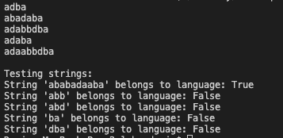

# Laboratory work nr. 1 - Regular grammars
### Course: Formal Languages & Finite Automata
### Author: Rateeva Daria

----

## **Theory**
In the study of **formal languages and automata**, a **formal language** is a structured way of representing information using a well-defined set of symbols. The foundation of this concept lies in **grammars** and **finite automata**, which are essential in fields like **compiler design, artificial intelligence, and natural language processing**.

### **1. Grammars**
A **grammar** is a formal set of rules that describes how words and sentences can be formed in a language. It is formally defined as:
> **G = (VN, VT, P, S)**

Where:
- **VN (Non-Terminals)** – A finite set of symbols that act as placeholders (e.g., `S, A, B`).
- **VT (Terminals)** – A finite set of actual symbols in the language (e.g., `a, b, d`).
- **P (Productions)** – A set of rules that specify how non-terminals can be replaced.
- **S (Start Symbol)** – The initial non-terminal from which derivations begin.

A **derivation** in a grammar follows production rules to transform the start symbol into a valid sentence (string) in the language.

#### **Chomsky Hierarchy of Grammars**
Noam Chomsky classified grammars into four types based on their expressive power:
1. **Type 0 (Unrestricted Grammars)** – No constraints on production rules.
2. **Type 1 (Context-Sensitive Grammars)** – Productions must maintain or increase string length.
3. **Type 2 (Context-Free Grammars, CFGs)** – Each rule has a **single non-terminal** on the left-hand side.
4. **Type 3 (Regular Grammars)** – Rules must follow specific linear restrictions.

In this laboratory work, we work with **Regular Grammars**, which are closely related to **finite automata**.


### **2. Finite Automata**
A **finite automaton (FA)** is a computational model used to recognize patterns and validate whether a given string belongs to a language.

A **finite automaton** is defined as:
> **FA = (Q, Σ, δ, q0, F)**

Where:
- **Q** – A finite set of states.
- **Σ** – A finite alphabet (set of input symbols).
- **δ (delta function)** – A transition function mapping `(current state, input) → next state`.
- **q0** – The initial state.
- **F** – A set of final (accepting) states.

There are **two types of finite automata**:
1. **Deterministic Finite Automaton (DFA)** – Each state has **exactly one transition** per input symbol.
2. **Nondeterministic Finite Automaton (NFA)** – A state **can transition to multiple states** for the same input symbol.

In this laboratory work, we convert a **grammar** into a **finite automaton** and implement a method to check whether a given string **belongs to the language**.


### **3. Relationship Between Grammars & Finite Automata**
- **Regular grammars** correspond directly to **finite automata**.
- **A finite automaton can be used to determine whether a given string belongs to the language generated by a grammar**.

This lab demonstrates how we can **generate valid strings from a grammar**, convert it to an automaton, and use the automaton to **validate input strings**.

---


## **Objectives**
The primary objective of this laboratory work is to explore the **concept of formal languages** and their **relationship with finite automata** by implementing a **Grammar class** and a **Finite Automaton class**. The following tasks were completed:

- Understand **what a formal language is** and what it needs to be considered well-defined.
- Set up a structured **GitHub repository** to manage the evolving project.
- Select a **suitable programming language** for the implementation.
- Store reports separately to ensure **easy verification and evaluation**.
- Implement a **Grammar class** that:
  - Defines **non-terminals (VN), terminals (VT), production rules (P), and a start symbol (S)**.
  - Generates **5 valid strings** using production rules.
  - Converts the **grammar into a finite automaton**.
- Implement a **Finite Automaton class** that:
  - Stores states, alphabet, transitions, and final states.
  - Simulates state transitions based on input strings.
  - Determines **whether a given string belongs to the language**.
- Test the **Finite Automaton** using multiple input strings to verify correctness.

---
# **Implementation Description**
In this section, we explore the implementation details of the code that demonstrates how to define and work with a regular grammar and its equivalent finite automaton. First, we discuss how the Grammar class is constructed, detailing its non-terminals, terminals, production rules, and start symbol. We then show how this class can generate valid strings by methodically replacing non-terminals until only terminal symbols remain. Next, we illustrate the conversion of the grammar to a FiniteAutomaton, highlighting how production rules become transitions in the automaton. We also describe how the FiniteAutomaton class manages states, transitions, and final states, providing a method to verify whether a given string is accepted. Finally, the main function demonstrates how to use these classes together: it generates multiple valid strings, builds the automaton, and tests several sample inputs for membership in the language. Taken as a whole, this implementation shows the close relationship between regular grammars and finite automata and offers practical insight into their use in formal language theory.
## **1. Grammar Class**

### **1.1 Constructor**
```python
class Grammar:
    def __init__(self):
        self.VN = {'S', 'A', 'C', 'D'}  # Non-terminals
        self.VT = {'a', 'b', 'd'}       # Terminals
        self.P = {                      # Production rules
            'S': ['aA'],
            'A': ['bS', 'dD'],
            'D': ['bC', 'aD'],
            'C': ['a', 'bA']
        }
        self.S = 'S'  # Start symbol
```
**Explanation**:  
This constructor initializes the main components of the grammar: the set of non-terminals (`VN`), the set of terminals (`VT`), and the production rules (`P`). The start symbol (`S`) is set to `'S'`. These definitions allow the grammar to generate strings and convert itself into a corresponding finite automaton.

---

### **1.2 Generating a Valid String**
```python
def generate_string(self):
    current = self.S  
    steps = 0

    while any(char in self.VN for char in current) and steps < 50:  # Limit steps to prevent infinite loops
        nt_to_replace = random.choice([char for char in current if char in self.VN])
        production = random.choice(self.P[nt_to_replace])
        current = current.replace(nt_to_replace, production, 1)
        steps += 1

    return current if all(char in self.VT for char in current) else None
```
**Explanation**:  
The `generate_string` method repeatedly replaces any non-terminal in the current string with one of its possible productions. It continues this process until there are no non-terminals left or until it reaches a safety limit (50 iterations). The final string, if it contains only terminal symbols, is returned as a valid member of the language.

---

### **1.3 Converting Grammar to Finite Automaton**
```python
def toFiniteAutomaton(self):
    states = set(self.VN)  # non-terminals -> states
    transitions = {}
    final_states = set()

    for non_terminal in self.P:
        transitions[non_terminal] = {}

        for production in self.P[non_terminal]:
            if len(production) == 1 and production in self.VT:
                if production not in transitions[non_terminal]:
                    transitions[non_terminal][production] = set()
                transitions[non_terminal][production].add(non_terminal)
                final_states.add(non_terminal)
            else:
                first_symbol = production[0]
                next_state = production[1] if len(production) > 1 else None

                if first_symbol not in transitions[non_terminal]:
                    transitions[non_terminal][first_symbol] = set()

                if next_state:
                    transitions[non_terminal][first_symbol].add(next_state)
                else:
                    final_states.add(non_terminal)

    fa = FiniteAutomaton(
        states=states,
        alphabet=self.VT,
        transitions=transitions,
        start_state=self.S,
        final_states=final_states
    )
    return fa
```
**Explanation**:  
This method builds a `FiniteAutomaton` object by treating each non-terminal as a state. Production rules are examined to construct the transition function, and states that can produce solely terminal symbols (or end a production) are considered final. This follows the principle that every regular grammar can be mapped to a corresponding finite automaton.

---

## **2. Finite Automaton Class**

### **2.1 Constructor**
```python
class FiniteAutomaton:
    def __init__(self, states, alphabet, transitions, start_state, final_states):
        self.Q = states               # Set of states
        self.Sigma = alphabet        # Input alphabet
        self.delta = transitions     # Transition function
        self.q0 = start_state        # Start state
        self.F = final_states        # Set of final (accepting) states
```
**Explanation**:  
The `FiniteAutomaton` constructor stores the fundamental components of any finite automaton: states, alphabet, transitions, start state, and final states. Together, these define how the automaton processes an input and decides whether it should be accepted. This separation of concerns makes it straightforward to implement operations like validating input strings.

---

### **2.2 Checking String Acceptance**
```python
def stringBelongToLanguage(self, input_string):
    current_states = set([self.q0])

    for char in input_string:
        if char not in self.Sigma:
            return False

        next_states = set()
        for state in current_states:
            if state in self.delta and char in self.delta[state]:
                for nxt in self.delta[state][char]:
                    next_states.add(nxt)

        if not next_states:
            return False
        current_states = next_states

    return bool(current_states.intersection(self.F))
```
**Explanation**:  
The `stringBelongToLanguage` method simulates the processing of a string by the finite automaton. For each character, it calculates all possible next states based on the transition function. After consuming all characters, it checks if the automaton’s current states overlap with its set of final states, indicating correct results.

---

## **3. Main Function**
```python
def main():
    grammar = Grammar()
    generated_strings = set()
    while len(generated_strings) < 5:
        new_string = grammar.generate_string()
        generated_strings.add(new_string)

    for string in generated_strings:
        print(string)
    
    # Convert to finite automaton
    fa = grammar.toFiniteAutomaton()
    
    # Testing strings
    test_strings = ["adbbbababadbbbadaaabbbabadaabbbabadba", "abb", "abd", "ba", "dba"]
    print("\nTesting strings:")
    for test_str in test_strings:
        belongs = fa.stringBelongToLanguage(test_str)
        print(f"String '{test_str}' belongs to language: {belongs}")

if __name__ == "__main__":
    main()
```
**Explanation**:  
The `main` function first instantiates the `Grammar` class and generates five random valid strings from it. It then converts this grammar into a finite automaton and tests several example strings to determine whether they belong to the language. This provides a complete demonstration of how strings can be generated and validated against the defined grammar and its corresponding automaton.

---
# **Conclusion**

In this laboratory work, I set out to implement a **Grammar** class and its equivalent **Finite Automaton** class to demonstrate the practical use of regular grammars and automata. By defining non-terminals, terminals, and production rules, I was able to generate valid strings that follow the structure of the grammar. The conversion of these rules into a finite automaton provided a systematic way to test any input string against the language and determine if it belongs. 

Below is a screenshot of the console output:


The screenshot displays a few generated strings, such as `adba`, `abadaba`, and `adabbdba`, alongside the results of testing several example strings. Notably, the string `ababadaaba` was accepted by the automaton because it adheres to the production rules, whereas strings like `abb` and `abd` were rejected. These results confirm that our finite automaton’s transitions are accurately derived from the grammar’s production rules. Ultimately, this work illustrates the strong correspondence between **regular grammars** and **finite automata**, showing that if a grammar can generate a certain string, the automaton constructed from that grammar will accept it—and reject any string that does not conform to the language.

---

## **References**
1. Article **"Introduction of Finite Automata"**, by GeeksforGeeks – [https://www.geeksforgeeks.org/introduction-of-finite-automata/](https://www.geeksforgeeks.org/introduction-of-finite-automata/)  
2. Article **"Finite-state machine"**, by Wikipedia – [https://en.wikipedia.org/wiki/Finite-state_machine](https://en.wikipedia.org/wiki/Finite-state_machine)  
3. Article **"Introduction to Grammar in Theory of Computation"**, by GeeksforGeeks – [https://www.geeksforgeeks.org/introduction-to-grammar-in-theory-of-computation/](https://www.geeksforgeeks.org/introduction-to-grammar-in-theory-of-computation/)

