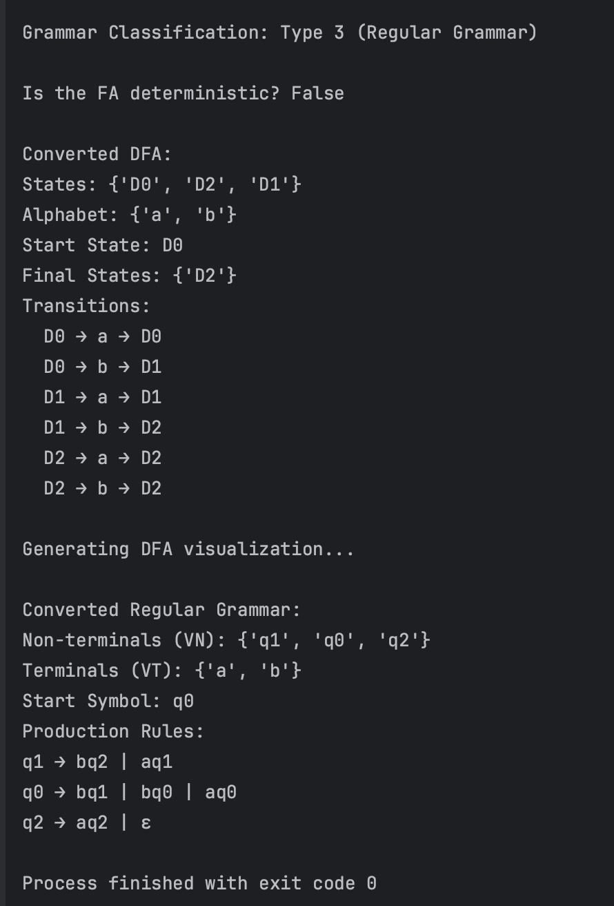
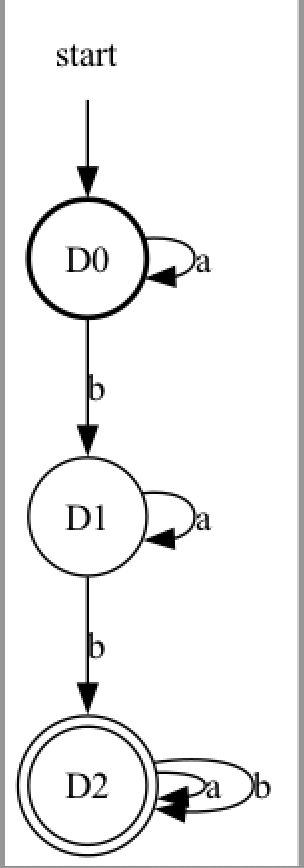

# Laboratory work nr. 2 - Determinism in Finite Automata. Conversion from NDFA 2 DFA. Chomsky Hierarchy.
### Course: Formal Languages & Finite Automata
### Author: Rateeva Daria

----

## **Theory**
### 1. Finite Automata
A **finite automaton (FA)** is a mathematical model used to recognize patterns in input strings based on a set of predefined rules. It consists of:
- **Q** → A finite set of states.
- **Σ** → A finite set of input symbols (alphabet).
- **δ** → A transition function `δ: Q × Σ → Q`.
- **q₀** → A start state.
- **F** → A set of final (accepting) states.

An FA processes an input string by transitioning between states according to the transition function **δ**. If the input is fully processed and the FA is in a final state, the string is **accepted**; otherwise, it is **rejected**.

There are two types of finite automata:
1. **Deterministic Finite Automaton (DFA)** - At each state, there is **exactly one transition** per input symbol.
2. **Non-Deterministic Finite Automaton (NDFA)** - A state can have **multiple transitions** for the same input symbol or even transitions without consuming input (`ε-transitions`).

---

### 2. Chomsky Hierarchy
The **Chomsky hierarchy** is a classification of formal grammars used to describe different types of languages:

1. **Type 0 (Unrestricted Grammar)** - The most general type, where production rules have no restrictions.
2. **Type 1 (Context-Sensitive Grammar)** - The left-hand side of a production rule must be smaller or equal in length to the right-hand side.
3. **Type 2 (Context-Free Grammar - CFG)** - Each production rule has a **single non-terminal** on the left-hand side.
4. **Type 3 (Regular Grammar - RG)** - The simplest type, where production rules are **right-linear** (`A → aB` or `A → a`) or **left-linear** (`A → Ba` or `A → a`).

Regular grammars are **equivalent to finite automata**, meaning every **regular language** can be recognized by a **finite automaton**, and every **finite automaton** can be converted into a **regular grammar**.

---

### 3. Transition from FA to Regular Grammar
A **finite automaton** can be converted into a **regular grammar** by:
- Mapping **states of the FA** to **non-terminals of the grammar (VN)**.
- Using **input symbols (Σ) as terminals (VT)**.
- Creating **production rules** based on FA transitions:
  - If `δ(q, a) = p`, add `q → ap` to the grammar.
  - If `q` is a final state, also add `q → ε` (ε represents an empty string).

This ensures that the **language recognized by the FA** is the same as the **language generated by the regular grammar**.

---

### 4. Determining Whether an FA is Deterministic or Non-Deterministic
To check if a **finite automaton is deterministic**:
1. Ensure that **each state has exactly one transition per input symbol**.
2. Ensure that **there are no ε-transitions** (transitions without consuming input).

If **any state has multiple transitions for the same input symbol**, the FA is **non-deterministic (NDFA)**.

---

### 5. Conversion of NDFA to DFA (Subset Construction)
A **Non-Deterministic Finite Automaton (NDFA)** can be converted into an **equivalent Deterministic Finite Automaton (DFA)** using the **subset construction algorithm**:
1. **Start with the initial DFA state** as the **set of NDFA start states**.
2. **For each DFA state**, compute the possible transitions by combining all reachable NDFA states.
3. **Repeat the process** until all possible states are accounted for.
4. **Mark any DFA state as final** if it contains at least one final NDFA state.

The resulting DFA will be **equivalent** to the original NDFA in terms of the language it accepts.

---

This laboratory work focuses on analyzing **determinism in finite automata**, converting an **NDFA to a DFA**, and transforming a **finite automaton into a regular grammar**. Additionally, we **classify grammars using the Chomsky hierarchy** and visualize the FA using **Graphviz**.

---


## Objectives

The primary objectives of this lab are:

1. **Understand the fundamentals of finite automata**  
   - Learn how automata function as state machines and their role in modeling processes.  
   - Understand the difference between **deterministic (DFA) and non-deterministic (NDFA) automata**.  

2. **Classify a given grammar based on the Chomsky hierarchy**  
   - Implement a function that analyzes and classifies a grammar into **Type 0, Type 1, Type 2, or Type 3**.  
   - Apply the classification to a **specific grammar variant** from the previous lab.  

3. **Convert a finite automaton into a regular grammar**  
   - Implement an algorithm that transforms an FA into a **Regular Grammar (RG)**.  
   - Ensure the resulting grammar maintains the same language as the FA.  

4. **Determine whether a given FA is deterministic or non-deterministic**  
   - Implement a method that checks if an FA has **multiple transitions for a single input symbol**.  
   - Ensure that the detection mechanism works correctly for different FA structures.  

5. **Convert an NDFA into a DFA using the subset construction method**  
   - Develop an algorithm that transforms an **NDFA into an equivalent DFA**.  
   - Ensure the DFA maintains the same accepted language as the original NDFA.  
   - Verify the correctness of the conversion by analyzing the DFA's structure and transitions.  

6. **Visualize the finite automaton graphically** (Bonus Objective)  
   - Implement a function that generates a **graphical representation of the FA using Graphviz**.  
   - Ensure that **states, transitions, start and final states are correctly displayed**.  

7. **Maintain project structure and documentation**  
   - Ensure that all code is located within the **same repository** as previous labs.  
   - Document the project following the **Markdown report template (`REPORT_TEMPLATE.md`)**.  
   - Submit the repository link on **ELSE** before the deadline for evaluation.  


---
## Implementation Details

In this section, we explore the implementation details of the code that demonstrates how to define and work with a finite automaton, classify its corresponding grammar, and transform a non-deterministic finite automaton (NDFA) into a deterministic finite automaton (DFA). 

First, we discuss the **ExtendedGrammar class**, detailing how it defines **non-terminals, terminals, production rules, and the start symbol**, and how it classifies a given grammar based on the **Chomsky hierarchy**. We then illustrate the conversion of a **finite automaton into a regular grammar**, explaining how **transitions in the automaton correspond to production rules in the grammar**.

Next, we focus on the **FiniteAutomaton class**, which models a finite automaton by managing its **states, alphabet, transitions, start state, and final states**. We describe how this class determines whether an automaton is **deterministic or non-deterministic** and provide a method to **convert an NDFA into an equivalent DFA** using the **subset construction algorithm**. 

Additionally, we describe how the program generates a **graphical representation of the finite automaton using Graphviz**, showing how **states and transitions are visually represented**, ensuring that the converted DFA is properly structured.

Finally, the **main function** demonstrates the usage of these components together: it **classifies the grammar, creates the finite automaton, checks its determinism, converts the NDFA to a DFA, and visualizes the resulting DFA**. This implementation highlights the strong relationship between **regular grammars and finite automata**, while also offering practical insight into the process of eliminating non-determinism in formal language theory.


## **1.Grammar Class Explanation**

### **1.1 base.py - Grammar Class**
```python
class Grammar:
    def __init__(self, VN, VT, P, S):
        self.VN = VN  # Set of non-terminals
        self.VT = VT  # Set of terminals
        self.P = P    # Dictionary of production rules
        self.S = S    # Start symbol
```
**Explanation**:  
This code defines a Grammar class to represent a formal grammar. The constructor (__init__) takes four parameters and assigns them to instance variables:

- VN: A set of non-terminal symbols (e.g., variables like S, A).
- VT: A set of terminal symbols (e.g., a, b).
- P: A dictionary mapping non-terminals to their production rules (e.g., S → aA | bB).
- S: The start symbol where derivation begins.
It provides the basic structure for working with grammars in formal language theory.
---

### **1.2 ExtendedGrammar Class: `classify_chomsky_hierarchy` Method Explanation**
The `classify_chomsky_hierarchy` method determines where the grammar fits in the Chomsky hierarchy, a framework classifying grammars into four types based on their production rules. It checks each rule against criteria for regular (Type 3), context-free (Type 2), and context-sensitive (Type 1) grammars, defaulting to unrestricted (Type 0) if none apply. The method uses flags to track compliance and returns the most restrictive type the grammar satisfies.

```python
                is_regular = True  
        is_context_free = True 
        is_context_sensitive = True  

        for lhs, rhs_list in self.P.items():  # Iterate over production rules dictionary
            for rhs in rhs_list:  
                # Type 2 (Context-Free) Check
                if len(lhs) > 1:  # If left-hand side has more than one symbol
                    is_context_free = False  

                # Type 1 (Context-Sensitive) Check
                if len(lhs) > len(rhs):  # If left-hand side is longer than right-hand side
                    is_context_sensitive = False 
                 # Type 3 (Regular) Check
                if not (rhs.islower() or (rhs[:-1].islower() and rhs[-1].isupper())): 
                    is_regular = False 

```
This part sets up the classification process by initializing three boolean flags (`is_regular`, `is_context_free`, `is_context_sensitive`) to `True`, assuming the grammar meets all criteria initially. It then iterates over the production rules in `self.P`, where `lhs` is the left-hand side (a non-terminal) and `rhs_list` is a list of possible right-hand sides. For each production:
- **Context-Free Check**: If `lhs` has more than one symbol (e.g., `AB` instead of `A`), it’s not context-free, as Type 2 requires a single non-terminal on the LHS.
- **Context-Sensitive Check**: If `lhs` is longer than `rhs` (e.g., `ABC → AB`), it violates Type 1 rules, which require the LHS to be no longer than the RHS to restrict growth.
- **Regular Grammar**: The regular check tests if each right-hand side (`rhs`) is either all terminals (`islower()`) or terminals followed by one non-terminal (`rhs[:-1].islower() and rhs[-1].isupper()`), which defines right-linear Type 3 grammars (e.g., `A → ab` or `A → abB`). If this fails (e.g., `A → ABa`), `is_regular` becomes `False`.
These checks progressively eliminate grammar types if rules don’t conform.
This part initializes the string generation process. `current` starts as the grammar’s start symbol (`self.S`), and `steps` tracks iterations to prevent infinite loops. The `while` condition checks if any character in `current` is a non-terminal (`self.VN`) and ensures the process doesn’t exceed 50 steps, providing a safeguard against endless recursion.

```python
                          
        if is_regular: 
            return "Type 3 (Regular Grammar)"  # Simplest grammar type
        elif is_context_free:  
            return "Type 2 (Context-Free Grammar)"  # Next restrictive type
        elif is_context_sensitive: 
            return "Type 1 (Context-Sensitive Grammar)"  # More complex type
        else:  
            return "Type 0 (Unrestricted Grammar)"  # Most general type
```
This part completes the classification. The final conditional block then evaluates the flags in order of restrictiveness:
- If `is_regular` is still `True`, the grammar is Type 3 (most restrictive).
- If not, but `is_context_free` holds, it’s Type 2.
- If only `is_context_sensitive` remains, it’s Type 1.
- If all flags are `False`, it defaults to Type 0, allowing unrestricted rules.
This ensures the grammar is classified accurately based on its most restrictive properties.

## **2. Finite Automaton Class**
### **2.1 Converting Finite Automaton to Regular Grammar**


The `to_regular_grammar` method converts a finite automaton (FA) into an equivalent regular grammar (Type 3 in the Chomsky hierarchy). It maps FA states to non-terminals, the alphabet to terminals, and transitions to production rules, adding an epsilon (ε) production for final states. This ensures the grammar generates the same language as the FA recognizes, returning a `Grammar` object with the converted structure.
```python
non_terminals = self.Q  # FA states → Non-terminals
        terminals = self.Sigma  # FA alphabet → Terminals
        productions = {} 
```
This part sets up the conversion by defining the basic components of the regular grammar. `non_terminals` is assigned the FA’s states (`self.Q`), treating each state as a non-terminal symbol in the grammar. `terminals` uses the FA’s alphabet (`self.Sigma`) as the grammar’s terminal symbols. `productions` is initialized as an empty dictionary to store the production rules, which will be populated based on the FA’s transitions.

```python
        for state in self.Q: 
            productions[state] = []  

            if state in self.delta:  
                for symbol, next_states in self.delta[state].items(): 
                    for next_state in next_states:  
                        productions[state].append(f"{symbol}{next_state}") 
```
This part constructs the production rules by iterating over each state in `self.Q`. For each state, an empty list is created in `productions`. If the state has transitions (checked via `self.delta`), the method loops through each symbol and its associated next states. For every transition (e.g., `q0 --a--> q1`), it appends a production string (e.g., `"aq1"`) to the state’s production list, forming right-linear rules typical of regular grammars (e.g., `q0 → aq1`).

```python
             # If state is final, add epsilon (ε) transition
            if state in self.F:  # Check if the state is an accepting state
                productions[state].append("ε")  # Add epsilon to allow termination

        # Return a Grammar object
        return Grammar(VN=non_terminals, VT=terminals, P=productions, S=self.q0)  # Create and return the Grammar object
```
This part completes the conversion by handling final states and returning the result. If a state is in `self.F` (the set of final states), an epsilon production (`"ε"`) is added to its production list, allowing the grammar to terminate there (e.g., `q2 → ε`), which corresponds to accepting a string in the FA. Finally, a `Grammar` object is instantiated with the non-terminals (`VN`), terminals (`VT`), productions (`P`), and start symbol (`S` set to `self.q0`), encapsulating the regular grammar equivalent to the FA.

---


### **2.2 FiniteAutomaton Class: `is_deterministic` Method Explanation**

The is_deterministic method checks whether the finite automaton (FA) is deterministic (DFA) by examining its transition function (self.delta). A DFA requires that each state has exactly one transition per input symbol and no ε-transitions (empty string transitions). The method iterates through all states and their transitions, using a set to track symbols and returning False if any non-deterministic feature is detected, or True if the FA meets DFA criteria.
```python
        for state, transitions in self.delta.items():  
            seen_symbols = set() 
            for symbol, next_states in transitions.items(): 
                if symbol == "ε": 
                    return False  # ε-transitions indicate non-determinism
```

This part begins the determinism check by looping through each state in self.delta, which maps states to their transition dictionaries. For each state, seen_symbols is initialized as an empty set to keep track of input symbols encountered. The inner loop examines each symbol and its corresponding next states. If an ε-transition (symbol "ε") is found, the method immediately returns False, as ε-transitions are a hallmark of non-determinism, allowing the FA to move without consuming input.

```python
                if len(next_states) > 1:  
                    return False  # Multiple next states indicate non-determinism
                if symbol in seen_symbols:  
                    return False  # Duplicate transitions violate DFA rules
                seen_symbols.add(symbol)  
        return True  # All checks passed, FA is deterministic
```
This part continues the check within the inner loop. If a symbol leads to multiple next states (len(next_states) > 1), it returns False, as a DFA must have exactly one destination per symbol. If a symbol is already in seen_symbols, it means the state has multiple transitions for that symbol, violating DFA rules, so it returns False. Otherwise, the symbol is added to seen_symbols. If the loops complete without returning False, all states satisfy DFA conditions (no ε-transitions, one transition per symbol), and the method returns True.

---

### **2.3 FiniteAutomaton Class: `convert_ndfa_to_dfa` Method Explanation**

The convert_ndfa_to_dfa method transforms a non-deterministic finite automaton (NDFA) into an equivalent deterministic finite automaton (DFA) using the subset construction method. It creates DFA states from sets of NDFA states, processes transitions by combining all possible NDFA outcomes, and ensures the resulting DFA recognizes the same language. The method uses a queue to explore new states and returns a new FiniteAutomaton object representing the DFA.

```python
        queue = [frozenset([self.q0])] 
        dfa_start = queue[0]  
        dfa_transitions = {} 
        dfa_final_states = set()  
        seen_states = {}  
```
 
This part initializes the conversion process. queue starts with a frozen set containing the NDFA’s start state (self.q0), representing the DFA’s initial state. dfa_start captures this starting set. dfa_transitions is an empty dictionary to store the DFA’s transition table, and dfa_final_states is a set for the DFA’s accepting states. seen_states maps each unique set of NDFA states to a DFA state name (e.g., D0, D1), ensuring no duplicates are processed.

```python
           while queue:  
            current = queue.pop(0) 
            if current not in seen_states:  
                seen_states[current] = f"D{len(seen_states)}" 
            current_name = seen_states[current] 
            if any(state in self.F for state in current):  
                dfa_final_states.add(current_name)  
            if current_name not in dfa_transitions:  
                dfa_transitions[current_name] = {} 
```
This part processes each DFA state from the queue. current is the next set of NDFA states to handle, removed from the queue’s front. If current isn’t in seen_states, it’s assigned a unique name (e.g., D0). current_name retrieves this name. If any NDFA state in current is in self.F (NDFA final states), current_name is added to dfa_final_states. The method then ensures dfa_transitions has an entry for current_name, initializing it as an empty dictionary if needed.

```python
             for symbol in self.Sigma: 
                next_state = frozenset( 
                    sum([list(self.delta.get(s, {}).get(symbol, [])) for s in current], [])
                )
                if next_state:
                    if next_state not in seen_states:  
                        seen_states[next_state] = f"D{len(seen_states)}" 
                        queue.append(next_state) 
                    dfa_transitions[current_name][symbol] = seen_states[next_state]  
        return FiniteAutomaton(  # Create and return the DFA
            states=set(seen_states.values()),
            alphabet=self.Sigma,
            transitions=dfa_transitions,
            start_state=seen_states[dfa_start],
            final_states=dfa_final_states
        )  
```

This part builds the DFA transitions and finalizes the result. For each symbol in self.Sigma, next_state is computed as the set of all NDFA states reachable from any state in current via that symbol, using self.delta. If next_state is non-empty, it’s named (if new) and added to the queue, then set as the transition from current_name for that symbol in dfa_transitions. Once the queue is empty, a new FiniteAutomaton is returned with all DFA states (from seen_states), the original alphabet, transitions, start state, and final states.

---
### **2.4FiniteAutomaton Class: `visualize` Method Explanation**

The visualize method generates a graphical representation of the finite automaton (FA) using Graphviz, a tool for creating directed graphs. It creates nodes for states, edges for transitions, and a special indicator for the start state, rendering the result as a PNG file. The method distinguishes final states, the start state, and regular states visually, providing an intuitive depiction of the FA’s structure.

```python
        dot = graphviz.Digraph(format="png")  # Initialize Graphviz directed graph object
        # Ensure all states are correctly named
        state_labels = {state: state for state in self.Q}  # Create a dictionary mapping states to their labels
        # Add states to the graph
        for state in self.Q:  # Iterate over all states
            if state in self.F:  # Check if the state is a final state
                dot.node(state_labels[state], shape="doublecircle")  # Add final state with double circle
            elif state == self.q0:  # Check if the state is the start state
                dot.node(state_labels[state], shape="circle", style="bold")  # Add start state with bold circle
            else:  # Regular state
                dot.node(state_labels[state], shape="circle")  # Add regular state with plain circle
```

This part sets up the visualization by creating a dot object from Graphviz with PNG output format. state_labels is a dictionary mapping each state in self.Q to itself, ensuring consistent naming (though redundant here, it allows flexibility for renaming). The method then loops through all states in self.Q: final states (self.F) are drawn as double circles, the start state (self.q0) as a bold circle, and other states as plain circles, visually distinguishing their roles.

```python
        # Add transitions
        for state, transitions in self.delta.items():  # Iterate over states and their transitions
            for symbol, next_state in transitions.items():  # Iterate over symbols and next states
                # Ensure next_state is correctly mapped
                next_state_label = state_labels.get(next_state, str(next_state))  # Get label for next state
                dot.edge(state_labels[state], next_state_label, label=symbol)  # Add edge with symbol as label
```

This part adds transitions to the graph. It iterates over self.delta, which maps each state to its transition dictionary. For each state, it loops through symbols and their associated next states (though next_state may be a set in an NDFA, the code assumes single states or needs adjustment). next_state_label retrieves the label for the next state, defaulting to its string form if not found. An edge is drawn from the current state to next_state_label, labeled with the symbol (e.g., q0 --a--> q1), representing the transition.


```python
        # Add an invisible start node to indicate the start state
        dot.node("start", shape="none")  # Create an invisible node
        dot.edge("start", state_labels[self.q0])  # Draw an arrow to the start state
        # Render the graph
        dot.render(filename, view=True)  # Generate and display the graph as a PNG file
```

This part finalizes the visualization. An invisible node named "start" (shape "none") is added to mark the FA’s entry point, with an edge pointing to the start state (self.q0) via its label, clearly indicating where execution begins. Finally, dot.render generates the graph as a PNG file with the specified filename (defaulting to "finite_automaton"), and view=True opens it for viewing, completing the graphical representation.

---
## **3. Main Function**

The main function demonstrates key operations in formal language theory: classifying a grammar, checking an FA’s determinism, converting an NDFA to a DFA if needed, and transforming an FA into a regular grammar. It integrates the ExtendedGrammar and FiniteAutomaton classes, showcasing their functionality in a cohesive workflow. Below, the focus is on the core logic, omitting declarations and most print statements for brevity.

```python
    # Check and print Grammar classification
    classification = grammar.classify_chomsky_hierarchy()  # Classify the grammar
```

This part assesses the grammar’s type in the Chomsky hierarchy using classify_chomsky_hierarchy. The grammar, with rules like S → aA | bB, is analyzed for properties such as right-linearity (Type 3), single non-terminal LHS (Type 2), or length constraints (Type 1), determining its classification (likely Type 3 here due to its right-linear structure).

```python
        # Check if FA is Deterministic
    if not fa.is_deterministic():  # If FA is non-deterministic
        dfa = fa.convert_ndfa_to_dfa()  # Convert NDFA to DFA
        dfa.visualize("dfa_graph")  # Visualize the resulting DFA
```
 
This part checks the FA’s determinism with is_deterministic. The FA has multiple transitions (e.g., q0 --b--> {q0, q1}), indicating it’s an NDFA. If non-deterministic, convert_ndfa_to_dfa applies subset construction to create an equivalent DFA, which is then visualized using visualize, generating a Graphviz PNG file (dfa_graph.png) to display the DFA’s structure.

```python
    # Convert FA to Regular Grammar
    rg = fa.to_regular_grammar()  # Convert the FA to a regular grammar
```

This part transforms the FA into a regular grammar using to_regular_grammar. States become non-terminals, the alphabet becomes terminals, and transitions (e.g., q0 --a--> q0) become productions (e.g., q0 → aq0). Final states like q2 gain an ε production, ensuring the grammar generates the same language as the FA recognizes.

---
# **Conclusion**

This laboratory work focused on the study of determinism in finite automata, the transformation of a non-deterministic finite automaton (NDFA) into a deterministic finite automaton (DFA), and the equivalence between finite automata and regular grammars. The main tasks of this lab involved verifying whether a given finite automaton is deterministic, converting an NDFA to an equivalent DFA using the subset construction method, transforming a finite automaton into a regular grammar, and visualizing the results graphically.

To achieve these objectives, the first step was to implement a method that checks whether a given finite automaton is deterministic. This was done by iterating through the transitions of the automaton and verifying that each state has exactly one transition per input symbol and no ε-transitions. If multiple transitions for the same input symbol were found, the automaton was classified as non-deterministic. Next, the subset construction method was used to convert the NDFA into an equivalent DFA. This involved creating new states in the DFA that represented sets of NDFA states, systematically computing transitions for these sets, and ensuring that all reachable states were included. The transformed DFA preserved the language of the original NDFA while eliminating non-determinism. Additionally, the implementation included a function that converted the DFA into a regular grammar by mapping DFA states to non-terminals and transitions to production rules, ensuring that the resulting grammar generated the same language as the DFA. Finally, the finite automaton was visualized using Graphviz to provide a clear representation of its states and transitions, confirming that the DFA structure was correctly generated.






The results of the implementation, as shown in the output, indicate that the original finite automaton was non-deterministic, as the check for determinism returned False. This confirms that at least one state had multiple transitions for the same input symbol. After applying the subset construction algorithm, the generated DFA consisted of three states: D0, D1, and D2, with well-defined transitions. The transition structure shows that D0 loops on a and transitions to D1 on b, D1 loops on a and moves to D2 on b, and D2, being a final state, loops on both a and b. The graphical representation of the DFA, generated using Graphviz, further confirms the correctness of the transformation:

The textual output also verifies the correctness of the DFA conversion, displaying the set of DFA states, the alphabet, the start and final states, and the transitions. Additionally, the classification of the given grammar as Type 3 (Regular Grammar) is shown, followed by the successful transformation of the finite automaton into a corresponding regular grammar. The converted regular grammar consists of non-terminals {q1, q0, q2}, terminals {a, b}, and the start symbol q0, with production rules that correctly reflect the transitions of the DFA. The presence of an ε-production in q2 confirms that q2 is a final state, allowing the grammar to terminate appropriately. 

Overall, this laboratory work successfully demonstrated the fundamental principles of determinism in finite automata, the process of converting an NDFA to an equivalent DFA, and the close relationship between finite automata and regular grammars. The use of the subset construction method ensured that the DFA maintained the same accepted language as the original NDFA while eliminating non-deterministic behavior. The transformation from finite automaton to regular grammar provided further validation of the equivalence between these models in formal language theory. The graphical visualization using Graphviz played a crucial role in verifying the correctness of the generated DFA. By analyzing both the textual output and the graphical representation, it is evident that all transformations were correctly implemented, reinforcing the theoretical foundations of finite automata and their role in formal language processing.

---

## **References**
1. Article **"Difference between DFA and NFA"**, by GeeksforGeeks – [https://www.geeksforgeeks.org/difference-between-dfa-and-nfa/](https://www.geeksforgeeks.org/difference-between-dfa-and-nfa/)  
2. Article **"Conversion from NFA to DFA"**, by GeeksforGeeks – [https://www.geeksforgeeks.org/conversion-from-nfa-to-dfa/](https://www.geeksforgeeks.org/conversion-from-nfa-to-dfa/)  
3. Graphviz documentation  – [https://graphviz.readthedocs.io/en/stable/manual.html](https://graphviz.readthedocs.io/en/stable/manual.html)

