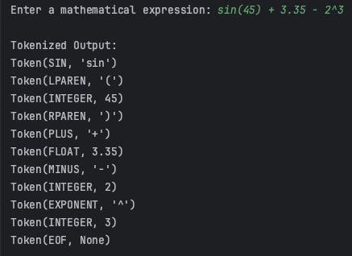

# Laboratory work nr. 3 - Lexer & Scanner
### Course: Formal Languages & Finite Automata
### Author: Rateeva Daria

----

## **Theory**
### What is a Lexer?
A **Lexer** (also known as a **scanner** or **tokenizer**) is a fundamental component of a compiler or interpreter that performs **lexical analysis**. It processes a sequence of characters from an input string and groups them into meaningful units called **lexemes**, which are then classified into **tokens**.

Lexical analysis is one of the first steps in language processing, used in programming languages, markup languages, and data parsing.

---

### What is Lexical Analysis?
**Lexical analysis** is the process of converting an input sequence of characters into a structured sequence of tokens. It involves:

1. **Reading** a stream of characters.
2. **Identifying** recognizable patterns such as numbers, keywords, operators, and punctuation.
3. **Classifying** them into predefined categories, called **tokens**.

For example, in the mathematical expression: 3.14 + sin(45)

The lexer breaks it down into separate meaningful units and categorizes them. The floating-point number "3.14" is identified as a number, the plus sign "+" is recognized as an operator, and "sin" is classified as a trigonometric function.

---

### What is a Lexeme?
A **lexeme** is a sequence of characters that forms a meaningful unit in the input string. It is simply a raw fragment of text that has been extracted from the input but has not yet been assigned a specific category.

For example, in the expression: cos(90) + 3.14


The following lexemes are extracted:

- "cos"
- "("
- "90"
- ")"
- "+"
- "3.14"

A lexeme is just a piece of text; it does not have meaning until it is assigned a token type.

---

### What is a Token?

A **token** is the categorized form of a lexeme. It consists of:

1. **A token type** that classifies the lexeme.
2. **An optional value** that stores additional metadata.

For example, in the expression `cos(90)`, the lexer recognizes:

- "cos" as a **SIN function** token.
- "90" as an **INTEGER** token.
- "(" and ")" as **LPAREN** and **RPAREN** tokens, respectively.

Tokens are used by the next stage in processing, such as a parser or an evaluator, to further understand and execute the input.

---

### Difference Between Lexeme and Token

A **lexeme** is the raw sequence of characters found in the input, while a **token** is the structured representation of that lexeme. 

For example, in the input: 3.14 + sin(45)

- "3.14" is a **lexeme**, but when classified, it becomes a **FLOAT token**.
- "sin" is a **lexeme**, but after classification, it becomes a **SIN function token**.
- "+" is a **lexeme**, which is recognized as a **PLUS token**.

Lexemes represent raw data extracted from the source, while tokens give those lexemes meaningful labels.

---

## Objectives

The main objectives of this laboratory work are:

- **Understand the concept of lexical analysis** and its role in programming language processing.
- **Learn about lexers (scanners/tokenizers)** and how they transform raw text into a sequence of structured tokens.
- **Distinguish between lexemes and tokens**, understanding their differences and how they interact within a lexer.
- **Implement a functional lexer** that can tokenize mathematical expressions, including:
  - Integer and floating-point numbers.
  - Basic arithmetic operators (`+`, `-`, `*`, `/`, `%`, `^`, `!`).
  - Parentheses (`(` and `)`).
  - Trigonometric functions (`sin`, `cos`, `tan`).
  - Logarithmic, square root, and exponential functions (`log`, `sqrt`, `exp`).
  - Constants (`pi`, `e`).
- **Ensure that the lexer correctly identifies invalid tokens** and handles errors appropriately.

---
## Implementation Details

The implemented lexer is designed to perform lexical analysis on mathematical expressions by identifying and categorizing meaningful components into tokens. It processes an input string character by character, extracts valid lexemes, and assigns them appropriate token types based on predefined rules.

This implementation supports integer and floating-point numbers, arithmetic operators, trigonometric and mathematical functions, as well as constants such as `pi` and `e`. Additionally, it handles parentheses for expression grouping and ensures that invalid characters are correctly flagged as errors.

The lexer consists of multiple components:
- A **token module** that defines token types and structures.
- A **lexer module** that processes input text and generates a sequence of tokens.
- A **main module** that provides an interface for users to input expressions and view tokenized output.

The following sections describe the functionality and structure of each component in detail.

## **1.Token module explanation**

### **1.1 tokens.py - TokenType Class**
```python
class TokenType:
    INTEGER = "INTEGER"
    FLOAT = "FLOAT"
    PLUS = "PLUS"
    MINUS = "MINUS"
    MULTIPLY = "MULTIPLY"
    DIVIDE = "DIVIDE"
    MODULO = "MODULO"
    EXPONENT = "EXPONENT"
    FACTORIAL = "FACTORIAL"
    LPAREN = "LPAREN"
    RPAREN = "RPAREN"
    SIN = "SIN"
    COS = "COS"
    TAN = "TAN"
    LOG = "LOG"
    SQRT = "SQRT"
    EXP = "EXP"
    ABS = "ABS"
    POW = "POW"
    PI = "PI"
    E = "E"
    EOF = "EOF"
    INVALID = "INVALID"

```
**Explanation**:  
This code defines a **TokenType** class that serves as an enumeration for different token categories in lexical analysis. Each class variable represents a specific type of token that the lexer can recognize and process.

- **Arithmetic Operators**: `PLUS`, `MINUS`, `MULTIPLY`, `DIVIDE`, `MODULO`, `EXPONENT`, `FACTORIAL` represent basic mathematical operations.
- **Parentheses**: `LPAREN` and `RPAREN` are used to group expressions.
- **Functions**: `SIN`, `COS`, `TAN`, `LOG`, `SQRT`, `EXP`, `ABS`, and `POW` represent mathematical and trigonometric functions.
- **Constants**: `PI` and `E` represent the mathematical constants π and Euler’s number.
- **Number Types**: `INTEGER` and `FLOAT` distinguish between whole numbers and decimal numbers.
- **EOF (End of File)**: `EOF` signifies the end of the input stream.
- **INVALID**: `INVALID` is used to identify unrecognized characters.

This classification enables the lexer to efficiently process input expressions by recognizing and categorizing each component accordingly.

---

### **1.2 tokens.py - Token Class**
```python
class Token:
    def __init__(self, type_, value=None):
        self.type = type_
        self.value = value

    def __repr__(self):
        return f"Token({self.type}, {repr(self.value)})"

```
**Explanation**:  
This code defines a **Token** class, which represents a unit of lexical analysis. Each token consists of a **type** (category) and an optional **value**.

- **Constructor (`__init__`)**:  
  - `type_`: Specifies the category of the token, which corresponds to a `TokenType` value.
  - `value`: Stores additional information, such as the actual number for numeric tokens or the name of a function.
  
- **String Representation (`__repr__`)**:  
  - Returns a formatted string in the form `Token(TYPE, VALUE)`, making it easier to debug and inspect tokenized output.

## **2. Lexer module explanation**

### **2.1 lexer.py - Lexer Class (Initialization and Utility Methods)**
```python
class Lexer:
    def __init__(self, text):
        self.text = text
        self.pos = 0

    def advance(self):
        """Move to the next character."""
        self.pos += 1

    def peek(self):
        """Look at the next character without moving forward."""
        if self.pos + 1 < len(self.text):
            return self.text[self.pos + 1]
        return None

```
**Explanation**:  
This code defines the **Lexer** class, responsible for performing lexical analysis by processing an input string character by character and extracting tokens.

- **Constructor (`__init__`)**:  
  - Initializes the `text` attribute to store the input string.
  - Sets `pos` to `0`, representing the current position in the input.

- **`advance()` Method**:  
  - Moves the cursor to the next character in the input string.
  - This method is called when a character has been processed.

- **`peek()` Method**:  
  - Returns the next character **without** advancing the position.
  - If there are no more characters left, it returns `None`.
  - This is useful for handling multi-character tokens like numbers or function names.

These methods serve as fundamental utilities that allow the lexer to traverse the input efficiently while extracting valid tokens.


---


### **2.2Lexer Class: `get_next_token` Method Explanation**

The `get_next_token` method processes the input string and extracts tokens one by one. It iterates through the characters, identifying numbers, functions, operators, and special symbols, returning the appropriate token type. If an unrecognized character is encountered, it is classified as an `INVALID` token. The function ensures that lexical analysis continues until the `EOF` token is reached.
```python
    def get_next_token(self):
        """Tokenize the input string."""
        while self.pos < len(self.text):
            char = self.text[self.pos]

            if char.isspace():  # Ignore whitespace
                self.advance()
                continue

            if char.isdigit() or char == '.':  # Handle numbers
                return self.number()
```

This part starts the tokenization process by iterating through the input string.

- It first checks if the current character is whitespace and skips it using advance().
- If the character is a digit or a decimal point (.), it calls the number() method to process numeric tokens (integers and floats).

```python
            if char.isalpha():  # Handle functions & constants
                return self.identifier()

            if char == '+':
                self.advance()
                return Token(TokenType.PLUS, '+')

            if char == '-':
                self.advance()
                return Token(TokenType.MINUS, '-')
```
This section checks if the character is alphabetic, which indicates a function name or a mathematical constant (sin, cos, pi, e), and processes it using identifier().

Next, it handles basic arithmetic operators:

- `+` is classified as a PLUS token.
- `-` is classified as a MINUS token.
Each operator is processed by advancing the cursor and returning the corresponding token.


```python
            if char == '*':
                self.advance()
                return Token(TokenType.MULTIPLY, '*')

            if char == '/':
                self.advance()
                return Token(TokenType.DIVIDE, '/')

            if char == '%':
                self.advance()
                return Token(TokenType.MODULO, '%')

            if char == '^':
                self.advance()
                return Token(TokenType.EXPONENT, '^')

            if char == '!':
                self.advance()
                return Token(TokenType.FACTORIAL, '!')

```
This section processes mathematical operators:

- `*` is classified as MULTIPLY.
- `/` is classified as DIVIDE.
- `%` is classified as MODULO.
- `^` is classified as EXPONENT (for power calculations).
- `!` is classified as FACTORIAL.
Each operator is recognized, tokenized, and returned immediately after calling advance() to move past the processed character.

```python
             if char == '(':
                self.advance()
                return Token(TokenType.LPAREN, '(')

            if char == ')':
                self.advance()
                return Token(TokenType.RPAREN, ')')

            # If we get here, it's an invalid character
            self.advance()
            return Token(TokenType.INVALID, char)

        return Token(TokenType.EOF, None)  # End of input


```
This final part handles parentheses and invalid characters:

- `(` is classified as LPAREN (left parenthesis).
- `)` is classified as RPAREN (right parenthesis).
If an unrecognized character is found, it is classified as INVALID, and the lexer moves forward.
When the end of the input is reached, the method returns an EOF (End of File) token, signaling that no more tokens remain.

**Explanation**:  
The get_next_token method efficiently scans input, identifies valid tokens, and skips whitespace while ensuring that unrecognized characters are flagged properly. It plays a crucial role in lexical analysis by breaking input into meaningful components.

---

### **2.3 Lexer Class: `number` Method Explanation**

The `number` method is responsible for recognizing **integer** and **floating-point numbers** in the input string. It reads consecutive digits (and at most one decimal point) to form a valid numeric token.

```python
    def number(self):
        """Recognizes integers and floating-point numbers."""
        num_str = ""
        is_float = False

        while self.pos < len(self.text) and (self.text[self.pos].isdigit() or self.text[self.pos] == '.'):
            if self.text[self.pos] == '.':
                if is_float:  # Second decimal point is invalid
                    break
                is_float = True
            num_str += self.text[self.pos]
            self.advance()
```
 
This part initializes two variables:

- `num_str`: A string to accumulate digits and the optional decimal point.
- `is_float`: A boolean flag to track whether the number is a floating-point number.
- 
The while loop iterates through the input as long as the character is a digit or a decimal point (.):
- If a decimal point is found and is_float is already True, it breaks the loop to prevent multiple decimal points (invalid number).
- Otherwise, is_float is set to True, and the character is appended to num_str.
- The advance() method moves the lexer to the next character.
This ensures that valid numeric sequences like 42, 3.14, and 0.001 are correctly processed, while invalid ones like 3.1.4 are stopped early.


```python
        if is_float:
            return Token(TokenType.FLOAT, float(num_str))
        else:
            return Token(TokenType.INTEGER, int(num_str))

```
This part determines the final token type:

- If `is_float` is True, the string is converted to a float, and a FLOAT token is returned.
- Otherwise, the string is converted to an `int`, and an INTEGER token is returned.
This ensures that:

- "42" → `Token(INTEGER, 42)`
- "3.14" → `Token(FLOAT, 3.14)`
The number method allows the lexer to correctly distinguish between whole numbers and decimal numbers, making it a crucial component for handling mathematical expressions.

---
### **2.4 Lexer Class: `identifier` Method Explanation**

The `identifier` method is responsible for recognizing **function names** and **mathematical constants**. It extracts sequences of alphabetic characters from the input, converts them to lowercase, and classifies them accordingly.

```python
    def identifier(self):
        """Recognizes function names and constants."""
        ident = ""
        while self.pos < len(self.text) and self.text[self.pos].isalpha():
            ident += self.text[self.pos]
            self.advance()

        ident_lower = ident.lower()
```

This part initializes an empty string ident, which will store the sequence of consecutive alphabetic characters.

- The while loop iterates through the input as long as the current character is a letter.
- Each letter is appended to `ident`, and `advance()` moves to the next character.
- Once the loop finishes, `ident_lower` stores the lowercase version of `ident`, ensuring case-insensitive matching (e.g., `"SIN"` and `"sin"` are treated the same).
This step ensures that valid function names and constants are extracted as complete words before classification.
```python
        function_map = {
            "sin": TokenType.SIN,
            "cos": TokenType.COS,
            "tan": TokenType.TAN,
            "log": TokenType.LOG,
            "sqrt": TokenType.SQRT,
            "exp": TokenType.EXP,
            "abs": TokenType.ABS,
            "pow": TokenType.POW,
        }

        constant_map = {
            "pi": (TokenType.PI, 3.14159),
            "e": (TokenType.E, 2.71828),
        }
```

This section defines two dictionaries:

- `function_map`: Maps recognized mathematical functions (sin, cos, tan, etc.) to their corresponding token types.
- `constant_map`: Maps recognized mathematical constants (pi, e) to their respective token types and values.
These mappings allow the lexer to efficiently categorize identifiers without using multiple if statements.

```python
        if ident_lower in function_map:
            return Token(function_map[ident_lower], ident_lower)
        elif ident_lower in constant_map:
            return Token(constant_map[ident_lower][0], constant_map[ident_lower][1])
        else:
            return Token(TokenType.INVALID, ident)

```

This final part classifies the extracted identifier:

- If `ident_lower` matches a function name in function_map, the corresponding token is returned.
- If `ident_lower` matches a constant name in constant_map, the corresponding token and numerical value are returned.
- If the identifier is not recognized, it is classified as an `INVALID` token.
This ensures that:

`"sin"` → `Token(SIN, "sin")`
`"PI"` → `Token(PI, 3.14159)`
`"unknown"` → `Token(INVALID, "unknown")`
The identifier method ensures that functions and constants are correctly identified while preventing invalid identifiers from being processed as valid tokens.
---

## **3. Main Function**

The `test_lexer` function serves as a testing utility for the lexer. It processes an input string, extracts tokens, and returns a list of tokens. The function continuously retrieves tokens from the lexer until the `EOF` token is encountered, ensuring that the entire input is processed.

```python
    def test_lexer(input_text):
    lexer = Lexer(input_text)
    tokens = []

    while True:
        token = lexer.get_next_token()
        tokens.append(token)
        if token.type == "EOF":
            break

    return tokens
```

This function initializes a Lexer instance with the given input text and an empty list tokens to store the extracted tokens.

- A while True loop repeatedly calls `get_next_token()` to retrieve the next token from the lexer.
- Each token is appended to the tokens list. 
- When an EOF (End of File) token is encountered, the loop breaks, ensuring the lexer has fully processed the input.
This method ensures that all tokens from the input expression are extracted in sequence.
- 
```python
   if __name__ == "__main__":
    user_input = input("Enter a mathematical expression: ")
    tokens = test_lexer(user_input)
    print("\nTokenized Output:")
    for token in tokens:
        print(token)

```
 
This section serves as the entry point for the program, allowing interactive testing of the lexer.

- The `if __name__ == "__main__"`: condition ensures that the code executes only when the script is run directly (not imported as a module).
- The program prompts the user to enter a mathematical expression as input.
- The input is passed to test_lexer(), which returns a list of extracted tokens.
- The tokens are printed one by one, displaying their type and value.

---
# **Conclusion**

This laboratory work focused on the study of **lexical analysis**, the implementation of a **lexer (scanner/tokenizer)**, and the process of **tokenizing mathematical expressions**. The main tasks of this lab involved understanding the distinction between **tokens and lexemes**, designing a structured lexer, and implementing functionality to recognize **numbers, arithmetic operators, functions, and constants**.

To achieve these objectives, the first step was to define a **TokenType** class that categorizes each recognized element into a structured token format. This was followed by implementing a **Token class** to store token attributes, making the lexer’s output clear and easy to process. The core functionality was implemented in the **Lexer class**, which iterated through the input string, extracting **valid tokens** while handling **whitespace, invalid characters, and different data types**. Special methods were developed for **identifying numbers (integers and floats)**, **recognizing function names and constants**, and **handling mathematical operators**.

The lexer was designed to support a wide range of mathematical expressions, including:
- **Basic arithmetic operations:** `+`, `-`, `*`, `/`, `%`, `^`, `!`
- **Trigonometric functions:** `sin`, `cos`, `tan`
- **Logarithmic and power functions:** `log`, `sqrt`, `exp`, `pow`
- **Mathematical constants:** `pi`, `e`
- **Floating-point and integer numbers**

To validate the implementation, we tested the lexer using various expressions. Below is a screenshot of the actual tokenized output for the input: sin(45) + 3.35 - 2^3




The tokenized output correctly classified:
- **Function calls**, such as `sin(45)`, into appropriate tokens.
- **Floating-point numbers** (`3.35`) and **integers** (`45`, `2`, `3`).
- **Operators**, including `+`, `-`, and `^` (exponentiation).
- **Parentheses** to ensure correct grouping in expressions.

This confirms that the lexer correctly extracts **lexemes**, classifies them into **tokens**, and ensures that expressions are structured properly for further processing.

Overall, this laboratory work successfully demonstrated the **importance of lexical analysis** in the early stages of language processing. By implementing a lexer capable of identifying **numbers, functions, constants, and operators**, we reinforced the principles of **tokenization and structured language parsing**. The results indicate that the lexer efficiently processes mathematical expressions, distinguishing between valid and invalid elements. 

Future improvements could include **support for variables, extended function sets, or error handling mechanisms for malformed expressions**. This implementation serves as a fundamental building block for **interpreters, compilers, and mathematical expression evaluators**, reinforcing the significance of lexical analysis in **formal language processing**.

---

## **References**
1. Article **"What Is Lexical Analysis?"**, by Coursera – [https://www.coursera.org/articles/lexical-analysis](https://www.coursera.org/articles/lexical-analysis)  
2. Article **"Lexical analysis"**, Wikipedia – [https://en.wikipedia.org/wiki/Lexical_analysis](https://en.wikipedia.org/wiki/Lexical_analysis)  
3. Article **"What is a token?"**, by Coursera – [https://www.coinbase.com/ru/learn/crypto-basics/what-is-a-token](https://www.coinbase.com/ru/learn/crypto-basics/what-is-a-token)  
