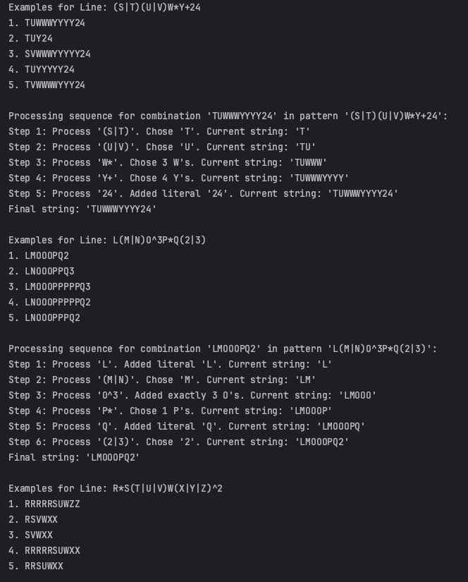
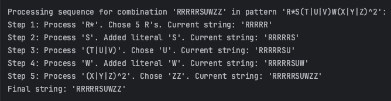

# Laboratory work nr. 4 - Regular expressions
### Course: Formal Languages & Finite Automata
### Author: Rateeva Daria

----

## **Theory**
### What is a Regular Expression?

A **regular expression (regex)** is a formal notation used to describe patterns in strings. It is widely used in pattern matching, text searching, and lexical analysis. Regular expressions belong to the class of **regular languages**, which can be represented by **finite automata**.

A regular expression consists of a combination of **characters** and **operators**, defining a set of strings that match the given pattern.

### Formal Definition of Regular Expressions

A regular expression over an **alphabet** \( \Sigma \) is defined recursively as follows:

1. **Base Cases:**
   - The empty string is a regular expression.
   - Any symbol a is a regular expression that denotes the language ({a}).

2. **Recursive Rules:**
   - **Concatenation**: If (r_1) and (r_2) are regular expressions, then their concatenation (r_1 r_2) is also a regular expression.
   - **Union (Alternation)**: If (r_1) and (r_2) are regular expressions, then (r_1 | r_2) is a regular expression denoting the union of the languages of (r_1) and (r_2).
   - **Kleene Star**: If (r) is a regular expression, then ( r^*) is a regular expression denoting zero or more repetitions of (r).

### Regular Expressions and Finite Automata

Regular expressions are closely related to **finite automata**:

- **Deterministic Finite Automaton (DFA)** and **Nondeterministic Finite Automaton (NFA)** can recognize languages described by regular expressions.
- For every regular expression, there exists an equivalent **NFA**.
- An NFA can be converted to a **DFA**, which can then be minimized.
- Conversely, for every finite automaton, there exists a corresponding regular expression.

### Operators in Regular Expressions

Regular expressions use various **operators** to define string patterns:

- `.` (dot) matches any single character.  
  Example: `a.b` matches `"acb"`, `"adb"`.

- `|` (alternation) acts as a logical OR between two patterns.  
  Example: `a|b` matches `"a"` or `"b"`.

- `*` (Kleene star) matches zero or more repetitions of the preceding character or group.  
  Example: `ab*` matches `"a"`, `"ab"`, `"abb"`, `"abbb"`, etc.

- `+` (plus) matches one or more repetitions of the preceding character or group.  
  Example: `ab+` matches `"ab"`, `"abb"`, `"abbb"`, etc.

- `^` (caret) represents the number of times an element will be repeated.  
  Example: `a^3` matches `"aaa"`, and `b^2` matches `"bb"`.

- `{n}` defines a specific number of repetitions of the preceding element.  
  Example: `a{4}` matches  `"aaaa"`.

### Properties of Regular Languages  

Regular expressions describe **regular languages**, which have the following properties:

- **Union**: If (L_1) and (L_2) are regular, then ( L_1 U L_2 ) is regular.
- **Concatenation**: If  (L_1) and (L_2) are regular, then (L_1L_2) is regular.
- **Kleene Star**: If (L) is regular, then (L^*) is regular.
- **Intersection** and **Complementation**: Regular languages are closed under these operations.

---
## Objectives

The main goal of this laboratory work is to understand and apply **regular expressions** in practical scenarios. The lab focuses on defining, using, and generating strings that conform to given regular expressions.

### Specific Objectives:

1. **Understand Regular Expressions**  
   - Define what regular expressions are and explain their purpose.  
   - Describe their practical applications in text processing, lexical analysis, and pattern matching.

2. **Implement Regular Expression Matching and String Generation**  
   - Given three complex regular expressions (assigned based on student number), write a program that generates valid symbol combinations that conform to the given regular expressions.  
   - Ensure that for patterns allowing an **undefined number of repetitions**, a limit of **5 repetitions** is enforced to avoid excessive string generation.

3. **Bonus Task: Processing Sequence of Regular Expressions**  
   - Implement a function that visualizes or logs the step-by-step processing of a given regular expression.  
   - This should include identifying individual components (e.g., character classes, quantifiers, alternations) and how they are sequentially applied to generate valid strings.

4. **Write a Comprehensive Report**  
   - Document all actions taken during the lab, including implementation details, code explanations, and results.  
   - Discuss encountered challenges and how they were addressed.  
   - Provide examples of generated valid strings along with explanations.


---
## Implementation Details

This laboratory work focuses on the practical application of **regular expressions**, specifically in generating valid strings that conform to predefined patterns and understanding the step-by-step processing of these expressions.

To achieve this, the implementation consists of three key components. First, a function generates valid combinations of symbols based on the given regular expressions, ensuring that each output adheres to the defined structure. Since some patterns contain elements that can repeat an **undefined number of times**, a limit of **five repetitions** is imposed to prevent excessively long outputs. Finally, an additional function is implemented to illustrate the **processing sequence** of a regular expression, showing the step-by-step application of its components.

The program systematically iterates through all possible valid symbol combinations, ensuring that the constructed strings match the given patterns. This provides insight into how regular expressions are evaluated and how different operators (such as concatenation, alternation, and repetition) influence the generation process. By visualizing the sequence in which elements are processed, we gain a clearer understanding of how regular expressions function at a deeper level.

The following sections describe the core logic and implementation details of each part of the program.


### **1. parse_regex method explanation**
```python
tokens = []
    i = 0
    while i < len(expression):
        char = expression[i]

        if char == "(":
            end = i + 1
            depth = 1
            while end < len(expression) and depth > 0:
                if expression[end] == "(":
                    depth += 1
                elif expression[end] == ")":
                    depth -= 1
                end += 1
            group_content = expression[i + 1:end - 1]
            options = group_content.split("|")
            token = ('choice', options)
            i = end

```
**Explanation**:  
This part of the code checks if the current character is an opening bracket (, which means a group with options like (A|B) is starting.
It then finds the matching closing bracket ) and extracts the content between them, like A|B.
It splits that content by | to get the list of options (e.g. ['A', 'B']), and stores it as a token: ('choice', ['A', 'B']).
Finally, it adds that token to the list and moves to the next part of the expression.


```python
        elif char in SUPERSCRIPT_MAP:
            prev = tokens.pop()
            count = SUPERSCRIPT_MAP[char]
            token = ('repeat', prev, count, count)
            i += 1

        elif char == '*':
            prev = tokens.pop()
            token = ('repeat', prev, 0, MAX_REPEAT)
            i += 1
```

This part handles repetition symbols in the regex:

- If the character is a superscript like ² or ³, it looks up how many times to repeat (e.g. ² means 2 times). It takes the previous token, wraps it in a ('repeat', token, count, count) structure, and adds it back.
- If the character is *, it means "repeat 0 to 5 times" (based on the defined MAX_REPEAT). It also pops the previous token and wraps it as a repeat with a random count between 0 and 5.
These tokens are then used later to generate the repeated characters.

```python
            elif char == '+':
            prev = tokens.pop()
            token = ('repeat', prev, 1, MAX_REPEAT)
            i += 1

        elif char.isspace():
            i += 1
            continue

        else:
            token = ('literal', char)
            i += 1

        tokens.append(token)
    return tokens
```
- If the character is +, it means "repeat 1 to 5 times".
- It takes the previous token and wraps it in a repeat token with range 1 to MAX_REPEAT.
- If the character is a space, it just skips it and continues.
Otherwise, it treats the character as a normal literal and creates a ('literal', char) token.
All created tokens are added to the tokens list, which will be used later to generate the final string.

---

### **2.generate_from_token method explanation**

```python
def generate_from_token(token):
    if token[0] == 'literal':
        return token[1]
    elif token[0] == 'choice':
        return random.choice(token[1])
    elif token[0] == 'repeat':
        _, inner_token, min_r, max_r = token
        repeat_count = random.randint(min_r, max_r)
        return ''.join(generate_from_token(inner_token) for _ in range(repeat_count))

```
This function takes a token and generates a string based on its type:

- If it's a 'literal', it just returns the character.
- If it's a 'choice', it randomly picks one option from the list.
- If it's a 'repeat', it picks a random number between min_r and max_r and repeats the inner token that many times.
It works recursively, so if the inner token is also a repeat or choice, it keeps going deeper until it builds the full string.


---

### **3. show_processing_sequence method explanation**
```python
def show_processing_sequence(pattern_part, combination):
    print(f"\nProcessing sequence for combination '{combination}' in pattern '{pattern_part}':")
    current_string = ""
    step = 1

    if pattern_part == "(S|T)(U|V)W*Y+24":
        # Step 1: (S|T)
        char = combination[0]
        current_string += char
        print(f"Step {step}: Process '(S|T)'. Chose '{char}'. Current string: '{current_string}'")
        step += 1

        # Step 2: (U|V)
        char = combination[1]
        current_string += char
        print(f"Step {step}: Process '(U|V)'. Chose '{char}'. Current string: '{current_string}'")
        step += 1
```
**Explanation**:  
This code defines the **show_processing_sequence** function, which prints the **step-by-step breakdown** of how a given string (`combination`) is processed according to a specified **regular expression pattern (`pattern_part`)**.

- **Function Definition (`show_processing_sequence`)**:  
  - Takes a **regular expression pattern** (`pattern_part`) and a **generated string** (`combination`).
  - Prints the initial message showing the pattern and combination being processed.
  - Initializes `current_string` as an empty string to store the progressively built output.
  - Defines a step counter `step = 1` to track the sequence of operations.

- **Processing `(S|T)(U|V)W*Y+24`**:  
  - The first **if condition** checks if the given pattern matches `(S|T)(U|V)W*Y+24`.
  - **Step 1 (`(S|T)`)**:
    - Extracts the first character from `combination` (`S` or `T`).
    - Appends it to `current_string`.
    - Prints the chosen character and updates the step counter.
  - **Step 2 (`(U|V)`)**:
    - Extracts the second character (`U` or `V`).
    - Appends it to `current_string`.
    - Prints the chosen character and updates the step counter.
  

```python
        # Step 3: W* (0 to 5 times)
        w_count = 0
        pos = 2
        while pos < len(combination) and combination[pos] == 'W':
            w_count += 1
            pos += 1
        current_string += "W" * w_count
        print(f"Step {step}: Process 'W*'. Chose {w_count} W's. Current string: '{current_string}'")
        step += 1

        # Step 4: Y+ (1 to 5 times)
        y_count = 0
        while pos < len(combination) and combination[pos] == 'Y':
            y_count += 1
            pos += 1
        current_string += "Y" * y_count
        print(f"Step {step}: Process 'Y+'. Chose {y_count} Y's. Current string: '{current_string}'")
        step += 1

        # Step 5: 24 (literal)
        current_string += "24"
        print(f"Step {step}: Process '24'. Added literal '24'. Current string: '{current_string}'")

```
**Explanation**:  
This part of the function processes the **`W*` (zero or more times), `Y+` (one or more times), and the fixed literal `"24"`** in the regular expression `(S|T)(U|V)W*Y+24`.

- **Step 3 (`W*`, zero to five times)**:  
  - Initializes `w_count = 0` to track how many `"W"` characters appear.
  - Starts scanning the string at `pos = 2`, which is after `(S|T)(U|V)`.
  - Uses a `while` loop to count consecutive `"W"` characters until a different character appears or the end of the string is reached.
  - Appends the counted `"W"` characters to `current_string`.
  - Prints the number of `"W"` repetitions and updates the step counter.

- **Step 4 (`Y+`, one to five times)**:  
  - Initializes `y_count = 0` to track how many `"Y"` characters appear.
  - Continues scanning the string from the current `pos`.
  - Uses a `while` loop to count consecutive `"Y"` characters (ensuring at least one appears, as required by `Y+`).
  - Appends the counted `"Y"` characters to `current_string`.
  - Prints the number of `"Y"` repetitions and updates the step counter.

- **Step 5 (`"24"`, fixed literal)**:  
  - Directly appends `"24"` to `current_string` since it is a **fixed part** of the pattern.
  - Prints that `"24"` has been added.
  - Completes the processing of this regular expression pattern.


```python
 elif pattern_part == "L(M|N)O^3P*Q(2|3)":
        # Step 1: L (literal)
        current_string += "L"
        print(f"Step {step}: Process 'L'. Added literal 'L'. Current string: '{current_string}'")
        step += 1

        # Step 2: (M|N)
        char = combination[1]
        current_string += char
        print(f"Step {step}: Process '(M|N)'. Chose '{char}'. Current string: '{current_string}'")
        step += 1

        # Step 3: O^3 (exactly 3 O's)
        current_string += "OOO"
        print(f"Step {step}: Process 'O^3'. Added exactly 3 O's. Current string: '{current_string}'")
        step += 1

```
**Explanation**:  
This part of the function processes the **`L(M|N)O^3P*Q(2|3)`** pattern, handling the fixed `"L"`, a choice between `"M"` or `"N"`, and exactly **three occurrences** of `"O"`.

- **Step 1 (`L`, fixed literal)**:  
  - Directly appends `"L"` to `current_string` since it is a **fixed** character.
  - Prints the step and updates the counter.

- **Step 2 (`(M|N)`, choice)**:  
  - Extracts the second character (`M` or `N`) from the string.
  - Appends it to `current_string`, prints the step, and updates the counter.

- **Step 3 (`O^3`, exactly three `O`s)**:  
  - Appends `"OOO"` directly since it must always appear three times.
  - Prints the step and updates the counter.
 


```python
        # Step 4: P* (0 to 5 times)
        p_count = 0
        pos = 5  # After L(M|N)OOO
        while pos < len(combination) and combination[pos] == 'P':
            p_count += 1
            pos += 1
        current_string += "P" * p_count
        print(f"Step {step}: Process 'P*'. Chose {p_count} P's. Current string: '{current_string}'")
        step += 1

        # Step 5: Q (literal)
        current_string += "Q"
        print(f"Step {step}: Process 'Q'. Added literal 'Q'. Current string: '{current_string}'")
        step += 1

        # Step 6: (2|3)
        char = combination[-1]
        current_string += char
        print(f"Step {step}: Process '(2|3)'. Chose '{char}'. Current string: '{current_string}'")

```

**Explanation**:  
This part of the function processes the remaining components of the **`L(M|N)O^3P*Q(2|3)`** pattern, handling optional repetitions of `"P"`, a fixed `"Q"`, and a choice between `"2"` or `"3"`.

- **Step 4 (`P*`, zero to five times)**:  
  - Initializes `p_count` to track the number of `"P"` occurrences.
  - Iterates through consecutive `"P"` characters, counting up to a maximum of 5.
  - Appends the counted `"P"` characters to `current_string`, prints the step, and updates the counter.

- **Step 5 (`Q`, fixed literal)**:  
  - Appends `"Q"` directly to `current_string` as it is always present.
  - Prints the step and updates the counter.

- **Step 6 (`(2|3)`, choice)**:  
  - Extracts the last character (`2` or `3`).
  - Appends it to `current_string`, prints the step, and completes processing.


```python
    elif pattern_part == "R*S(T|U|V)W(X|Y|Z)^2":
        # Step 1: R* (0 to 5 times)
        r_count = 0
        pos = 0
        while pos < len(combination) and combination[pos] == 'R':
            r_count += 1
            pos += 1
        current_string += "R" * r_count
        print(f"Step {step}: Process 'R*'. Chose {r_count} R's. Current string: '{current_string}'")
        step += 1

        # Step 2: S (literal)
        current_string += "S"
        print(f"Step {step}: Process 'S'. Added literal 'S'. Current string: '{current_string}'")
        step += 1

        # Step 3: (T|U|V)
        char = combination[pos + 1]
        current_string += char
        print(f"Step {step}: Process '(T|U|V)'. Chose '{char}'. Current string: '{current_string}'")
        step += 1
```

**Explanation**:  
This part of the function processes the **`R*S(T|U|V)W(X|Y|Z)^2`** pattern, handling optional repetitions of `"R"`, a fixed `"S"`, and a choice between `"T"`, `"U"`, or `"V"`.

- **Step 1 (`R*`, zero to five times)**:  
  - Initializes `r_count` to track occurrences of `"R"`.
  - Iterates through consecutive `"R"` characters, counting up to a maximum of 5.
  - Appends the counted `"R"` characters to `current_string`, prints the step, and updates the counter.

- **Step 2 (`S`, fixed literal)**:  
  - Appends `"S"` directly to `current_string` as it is always present.
  - Prints the step and updates the counter.

- **Step 3 (`(T|U|V)`, choice)**:  
  - Extracts the next character (`T`, `U`, or `V`).
  - Appends it to `current_string`, prints the step, and updates the counter.
 


```python
        # Step 4: W (literal)
        current_string += "W"
        print(f"Step {step}: Process 'W'. Added literal 'W'. Current string: '{current_string}'")
        step += 1

        # Step 5: (X|Y|Z)^2 (XX, YY, or ZZ)
        last_two = combination[-2:]
        current_string += last_two
        print(f"Step {step}: Process '(X|Y|Z)^2'. Chose '{last_two}'. Current string: '{current_string}'")

    print(f"Final string: '{current_string}'")
```

**Explanation**:  
This part of the function processes the final components of the **`R*S(T|U|V)W(X|Y|Z)^2`** pattern, handling the fixed `"W"` and exactly two occurrences of either `"X"`, `"Y"`, or `"Z"`.

- **Step 4 (`W`, fixed literal)**:  
  - Appends `"W"` directly to `current_string` since it is always present in the pattern.
  - Prints the step and updates the counter.

- **Step 5 (`(X|Y|Z)^2`, exactly two characters)**:  
  - Extracts the last two characters of the string, which must be either `"XX"`, `"YY"`, or `"ZZ"`.
  - Appends them to `current_string`, prints the step, and completes processing.

- **Final Output**:  
  - Prints the fully constructed `current_string`, representing the valid sequence generated from the regular expression.

--- 

### **4. main explanation**

```python
for pattern, breakdown_pattern in regex_pairs:
    print(f"\n--- Generating for: {pattern} ---")
    for i in range(3):
        combo = generate_string(pattern)
        print(f"{i + 1}. Generated: {combo}")
    # Use one example for breakdown
    example = generate_string(pattern).upper()  # convert to uppercase for matching breakdown logic
    show_processing_sequence(breakdown_pattern, example)
]
```

**Explanation**:  
This loop goes through each regex pattern:

- It prints the current pattern.
- Then it generates 3 random strings that match the pattern using generate_string() and prints them.
- After that, it generates one more string (converted to uppercase) and calls show_processing_sequence() to explain step-by-step how that string was built based on the pattern structure.
- The .upper() is used to match the format used in the breakdown logic.


---
# **Conclusion**


In this laboratory work, I explored the concept of **regular expressions**, their structure, and their application in **pattern matching and string generation**. The implementation involved generating valid strings based on **three different regular expressions** and analyzing their processing steps. Through this process, I gained a deeper understanding of how regular expressions are used to define patterns and how different operators, such as concatenation, alternation, and quantifiers, affect string formation.

One of the key aspects of this lab was the ability to generate valid strings that match given regular expressions. To achieve this, I implemented a function that systematically iterates through all possible symbol combinations while ensuring that patterns with undefined repetitions were constrained to a maximum of five occurrences. Additionally, I developed a function to visualize the **step-by-step processing** of a regular expression, which allowed me to observe how each character and operator contributes to constructing a valid string.

During the implementation, I encountered challenges such as handling **infinite repetitions** in patterns and ensuring that all expressions were correctly parsed. By imposing repetition limits and using structured iteration, I was able to prevent excessive output while maintaining accuracy. The final program successfully generated valid strings and provided a clear breakdown of how each component of the regular expression was processed.

Below are screenshots of the program’s execution, showing the **generated strings** for each regular expression and their **processing sequences**:

#### **Generated Strings and Processing for `(S|T)(U|V)W*Y+24` and `L(M|N)O^3P*Q(2|3)`**


#### **Generated Strings and Processing for `R*S(T|U|V)W(X|Y|Z)^2`**


Overall, this laboratory work provided valuable hands-on experience with **regular expressions**, helping me understand their fundamental role in **lexical analysis, pattern recognition, and text processing**. By implementing string generation and processing visualization, I was able to observe the practical applications of regular expressions and their importance in defining structured patterns within formal languages and finite automata.


---

## **References**
1. Article **"Regex Tutorial – How to write Regular Expressions?"**, by GeeksForGeeks – [https://www.geeksforgeeks.org/write-regular-expressions/](https://www.geeksforgeeks.org/write-regular-expressions/)  
2. Article **"Regular expression"**, Wikipedia – [https://en.wikipedia.org/wiki/Regular_expression](https://en.wikipedia.org/wiki/Regular_expression)  

