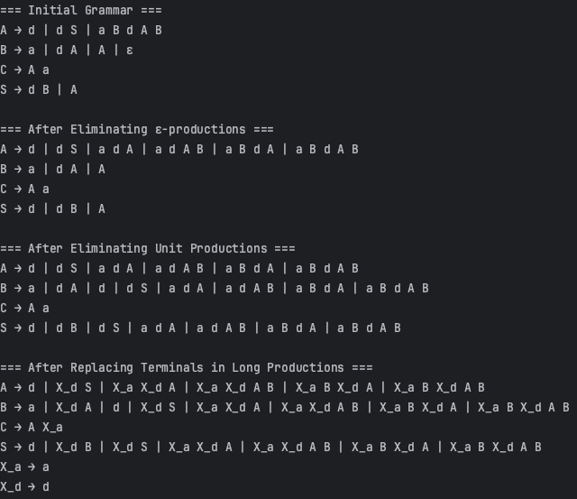
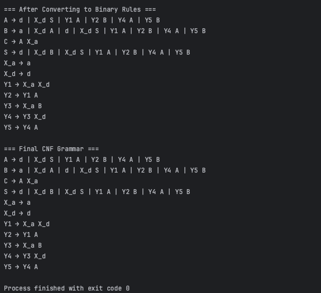

# Laboratory work nr. 5 - Chomsky Normal Form
### Course: Formal Languages & Finite Automata
### Author: Rateeva Daria

----
# Theory

## *Context-Free Grammar*
A Context-Free Grammar (CFG) is a formal system that describes the syntactic structure of a language. It is defined by four components:

- A set of non-terminal symbols (also called variables)
- A set of terminal symbols (the actual characters of the language)
- A set of production rules that describe how non-terminals can be expanded
- A start symbol from which all derivations begin

CFGs are widely used in computer science, particularly in the fields of compiler design, formal language theory, and syntactic analysis.

## *Chomsky Normal Form (CNF)*
Chomsky Normal Form (CNF) is a simplified representation of context-free grammars, where each production rule adheres to a restricted structure. A CFG is said to be in CNF if all of its production rules are of one of the following types:

- **A → BC** - A rule where a non-terminal produces exactly two non-terminals.
- **A → a** - A rule where a non-terminal produces a single terminal symbol.
- **S → ε (optional)** - The start symbol may produce the empty string only if the empty string is part of the language.

These restrictions allow for a more standardized form of grammar, which is particularly useful for certain parsing algorithms.

## *Importance of CNF*
Converting a CFG to CNF is a common step in formal language processing for several reasons:

- CNF allows for easier implementation of parsing algorithms, such as the CYK (Cocke–Younger–Kasami) algorithm.
- It provides a uniform structure for all production rules, which simplifies theoretical proofs and automated analysis.
- It makes it possible to analyze and recognize strings using efficient dynamic programming techniques.

## *CNF Conversion Steps*
**Step 1: Elimination of ε-productions**

Remove rules that derive the empty string, while preserving the ability to generate it if needed.

**Step 2: Elimination of unit productions**

Replace rules where one non-terminal directly derives another, reducing indirect derivations.

**Step 3: Removal of useless symbols**

Discard non-terminals that either cannot derive any terminal strings or are not reachable from the start symbol.

**Step 4: Replacement of terminals in long rules**

When terminals appear in rules with multiple symbols, they are replaced by new non-terminals that individually produce those terminals.

**Step 5: Conversion to binary rules**

All production rules with more than two symbols on the right-hand side are transformed into a series of binary rules using new helper non-terminals.

This transformation ensures that the resulting grammar maintains the same language but fits the strict structure required by CNF.
## Objectives:
1. Learn about Chomsky Normal Form (CNF).
2. Get familiar with the approaches of normalizing a grammar.
3. Implement a method for normalizing an input grammar by the rules of CNF.
    - The implementation needs to be encapsulated in a method with an appropriate signature (also ideally in an appropriate class/type).
    - The implemented functionality needs executed and tested.
    - Also, another BONUS point would be given if the student will make the aforementioned function to accept any grammar, not only the one from the student's variant.
      
# Implementation description
## *1.Converter*
### *Constructor*
```python
class CFGtoCNFConverter:
    def __init__(self, grammar, start_symbol):
        self.grammar = defaultdict(list)
        for head, bodies in grammar.items():
            for body in bodies:
                self.grammar[head].append(tuple(body))
        self.start_symbol = start_symbol
        self.counter = 1
        self.term_map = {}
```
This class defines the initial setup for the CFG-to-CNF converter. The `__init__` method takes the input grammar and start symbol, and prepares it for transformation. The grammar is stored using a `defaultdict` of lists, with each production rule body converted into a tuple for consistency. The `start_symbol` keeps track of where derivations begin. Additionally, a counter is initialized for generating new non-terminal symbols during transformation, and `term_map` is used to store mappings from terminal symbols to their corresponding helper non-terminals introduced later in the process.

### *Print Grammar*
```python
    def print_grammar(self, title):
        print(f"\n=== {title} ===")
        for head in sorted(self.grammar.keys()):
            bodies = [" ".join(body) for body in self.grammar[head]]
            print(f"{head} → {' | '.join(bodies)}")
```
This method is responsible for displaying the current state of the grammar in a readable format. It prints a given title for context, then iterates through all grammar rules, showing each non-terminal (`head`) followed by its corresponding production bodies. The bodies are joined into strings for a clean, human-friendly presentation, with alternatives separated by the `|` symbol — similar to standard grammar notation. This function is especially useful for visualizing changes after each transformation step.

### *Eliminate Epsilon*
```python
def eliminate_epsilon(self):
    nullable = set()
    for head, prods in self.grammar.items():
        for prod in prods:
            if prod == ('ε',):
                nullable.add(head)

    # Remove ε-productions
    for head in self.grammar:
        self.grammar[head] = [p for p in self.grammar[head] if p != ('ε',)]

    changed = True
    while changed:
        changed = False
        for head, prods in self.grammar.items():
            for prod in prods:
                if all(sym in nullable for sym in prod):
                    if head not in nullable:
                        nullable.add(head)
                        changed = True

```
This method begins the process of eliminating ε-productions—rules that allow a non-terminal to derive the empty string. It first scans the grammar to identify all non-terminals that directly produce ε, storing them in a `nullable` set. These are then removed from the grammar.

Next, it performs a fixed-point check to find non-terminals that are indirectly nullable, meaning they produce sequences consisting only of other nullable symbols. This is done by repeatedly checking all productions until no new nullable symbols can be found.
### *Eliminate Epsilon 2*
```python
    new_grammar = defaultdict(list)
    for head, prods in self.grammar.items():
        for prod in prods:
            indices = [i for i, sym in enumerate(prod) if sym in nullable]
            for mask in itertools.product([True, False], repeat=len(indices)):
                new_prod = list(prod)
                for i, remove in zip(indices, mask):
                    if remove:
                        new_prod[i] = None
                new_prod = tuple(sym for sym in new_prod if sym)
                if new_prod and new_prod not in new_grammar[head]:
                    new_grammar[head].append(new_prod)

    self.grammar = new_grammar
    self.print_grammar("After Eliminating ε-productions")

```
Once all nullable non-terminals are identified, the method reconstructs the grammar to account for every possible way nullable symbols could be omitted. For each production containing nullable symbols, it generates all `combinations of present/absent` nullable symbols using binary masks. The newly generated valid alternatives are added to the grammar only if they are non-empty and not duplicates.

Finally, the grammar is updated with this new version, and its state is printed for inspection.

### *Eliminate Unit Productions*
```python
def eliminate_unit_productions(self):
    unit_pairs = set()
    for head in self.grammar:
        for prod in self.grammar[head]:
            if len(prod) == 1 and prod[0].isupper():
                unit_pairs.add((head, prod[0]))

    while True:
        new_pairs = unit_pairs.copy()
        for (A, B) in unit_pairs:
            for prod in self.grammar.get(B, []):
                if len(prod) == 1 and prod[0].isupper():
                    new_pairs.add((A, prod[0]))
        if new_pairs == unit_pairs:
            break
        unit_pairs = new_pairs
```
This part identifies and expands all unit productions in the grammar. A unit production is a rule where a non-terminal directly produces another non-terminal, `like A → B`. First, all such direct unit pairs are collected. Then, the algorithm uses a loop to repeatedly discover indirect unit chains (`like A → B → C`) until no new pairs can be added. This ensures full transitive closure of all unit relations.

### *Eliminate Unit Productions 2*
```python
    new_grammar = defaultdict(list)
    for head, prods in self.grammar.items():
        for prod in prods:
            if not (len(prod) == 1 and prod[0].isupper()):
                new_grammar[head].append(prod)

    for (A, B) in unit_pairs:
        for prod in self.grammar[B]:
            if not (len(prod) == 1 and prod[0].isupper()) and prod not in new_grammar[A]:
                new_grammar[A].append(prod)

    self.grammar = new_grammar
    self.print_grammar("After Eliminating Unit Productions")

```
After identifying all unit pairs, this part reconstructs the grammar by removing unit productions entirely. First, all non-unit rules are copied into a new grammar. Then, for every unit pair (`A → B`), all non-unit rules of `B` are added to `A`. This effectively inlines the contents of each unit-linked non-terminal, ensuring that all productions become either terminal or binary rules — aligning with CNF requirements.

### *Replace Terminals*
```python
      def replace_terminals_in_long_productions(self):
        updated_grammar = defaultdict(list)
        for head, prods in self.grammar.items():
            for prod in prods:
                if len(prod) > 1:
                    new_prod = []
                    for sym in prod:
                        if not sym.isupper():
                            if sym not in self.term_map:
                                new_nonterminal = f"X_{sym}"
                                self.term_map[sym] = new_nonterminal
                                updated_grammar[new_nonterminal].append((sym,))
                            new_prod.append(self.term_map[sym])
                        else:
                            new_prod.append(sym)
                    updated_grammar[head].append(tuple(new_prod))
                else:
                    updated_grammar[head].append(prod)
        self.grammar = updated_grammar
        self.print_grammar("After Replacing Terminals in Long Productions")
```
This method ensures that **terminals do not appear in production rules with more than one symbol**, which is a requirement in Chomsky Normal Form. For each rule with multiple symbols on the right-hand side, it scans the sequence and replaces every terminal with a corresponding **new non-terminal symbol** (e.g., replacing `"a"` with `X_a`). These new symbols are stored in a map (`term_map`) to avoid duplication and are defined as producing their original terminal (e.g., `X_a → a`).  

The result is a version of the grammar where all long productions consist entirely of non-terminals, which prepares the grammar for the final binary rule conversion step. The method finishes by printing the transformed grammar for verification.

### *Variable Reuse or Creation*
```python
def convert_to_binary_rules(self):
    def create_new_symbol():
        sym = f"Y{self.counter}"
        self.counter += 1
        return sym

    bin_cache = {}  # (A, B) → New symbol
    updated_grammar = defaultdict(list)

```
This part sets up the binary rule conversion process. A helper function `create_new_symbol()` is defined to generate new non-terminal names (like `Y1`, `Y2`, etc.) needed for breaking down long productions. A dictionary `bin_cache` is used to remember which non-terminal was assigned to each pair of symbols to avoid redundant rules. An empty dictionary `updated_grammar` is also initialized to hold the updated binary-form grammar.

### *Variable Reuse or Creation 2 *
```python
    for head, prods in self.grammar.items():
        for prod in prods:
            symbols = list(prod)
            while len(symbols) > 2:
                pair = (symbols[0], symbols[1])
                if pair not in bin_cache:
                    new_sym = create_new_symbol()
                    bin_cache[pair] = new_sym
                    updated_grammar[new_sym].append(pair)
                new_nt = bin_cache[pair]
                symbols = [new_nt] + symbols[2:]
            updated_grammar[head].append(tuple(symbols))

    self.grammar = updated_grammar
    self.print_grammar("After Converting to Binary Rules")

```
This part performs the actual binary conversion. For each production with more than two symbols, it repeatedly groups the first two symbols into a pair and replaces them with a new non-terminal. This process continues until only two symbols remain, forming a proper binary rule. The transformation ensures no rule has more than two non-terminals on the right-hand side, as required by CNF. The final grammar is updated and printed for verification.

### *Convertor*
```python
    def convert(self):
        self.print_grammar("Initial Grammar")
        self.eliminate_epsilon()
        self.eliminate_unit_productions()
        self.replace_terminals_in_long_productions()
        self.convert_to_binary_rules()
        self.print_grammar("Final CNF Grammar")
        return dict(self.grammar)
```
This method carries out the complete transformation of a context-free grammar into Chomsky Normal Form. It starts by printing the initial state of the grammar, providing a clear view of the input. The conversion then proceeds step by step: first, it eliminates ε-productions, removing rules that generate the empty string. Next, it eliminates unit productions, which are rules where one non-terminal directly produces another. After that, it replaces terminals that appear in longer productions with new non-terminal symbols to ensure terminals only appear alone on the right-hand side. Then, it transforms all rules with more than two symbols on the right into binary rules using helper non-terminals. Once all transformations are complete, it prints the final grammar in CNF and returns it as a dictionary for further use. This method acts as the main coordinator of the entire CNF conversion process.

## *2.Main*
```python
cfg = {
    "S": [["d", "B"], ["A"]],
    "A": [["d"], ["d", "S"], ["a", "B", "d", "A", "B"]],
    "B": [["a"], ["d", "A"], ["A"], ["ε"]],
    "C": [["A", "a"]]
}

converter = CFGtoCNFConverter(cfg, start_symbol="S")
cnf = converter.convert()
```
This part of the program defines the initial context-free grammar using a dictionary structure, where each key represents a non-terminal and each value is a list of its production rules. The grammar is passed into an instance of the `CFGtoCNFConverter` class along with the start symbol `"S"`. Once initialized, the `convert()` method is called to apply all the transformation steps and produce the equivalent grammar in Chomsky Normal Form. The result is stored in the variable `cnf` for further use or analysis.

## *Output*




# Conclusion
This laboratory work focused on the process of transforming a context-free grammar (CFG) into Chomsky Normal Form (CNF), a standard representation used in formal language theory and parsing algorithms. The transformation required implementing and applying a series of well-defined steps that preserve the language of the original grammar while enforcing a strict syntactic structure.

The implementation began by identifying and removing ε-productions — rules that derive the empty string — while ensuring the grammar could still produce all valid strings of the original language. This was followed by the elimination of unit productions, which often introduce unnecessary indirect derivations. By replacing rules like A → B with the actual rules of B, the grammar was simplified and made more direct.

One of the most important steps was the replacement of terminal symbols that appear within longer productions. According to CNF rules, terminals must appear alone in a production; therefore, each terminal within a multi-symbol rule was replaced with a new non-terminal that maps directly to the original terminal. This step required careful mapping to avoid duplicating rules unnecessarily.

After ensuring all productions contained only non-terminals, the final step involved converting any rule with more than two symbols on the right-hand side into binary rules. This was done by introducing new helper non-terminals to break down longer productions into a chain of binary productions. An optimization was also added to avoid creating redundant binary rules by caching already processed symbol pairs.

The conversion process was implemented step-by-step in Python, and each transformation was printed out clearly, allowing easy tracking and verification of the changes made to the grammar at each stage. The final grammar obtained strictly followed CNF rules and was equivalent in language to the original CFG.

By completing this lab, I gained a solid understanding of both the theoretical and practical aspects of grammar normalization. It helped me see how formal rules from automata theory can be implemented programmatically, and how grammars can be systematically prepared for use in parsing techniques like CYK. Additionally, I became more comfortable working with symbolic data structures, rule transformations, and intermediate representations — skills that are highly relevant in compiler design and language processing.

Overall, this lab reinforced key concepts from formal language theory while also offering hands-on experience with implementing algorithms that deal with grammar structure and language transformation. It was a good mix of abstract theory and practical logic, and it helped clarify why CNF is such a useful and important form for computational applications.


## **References**
1. Article **"Chomsky normal form"**, by Wikipedia – [https://en.wikipedia.org/wiki/Chomsky_normal_form](https://en.wikipedia.org/wiki/Chomsky_normal_form)  
2. Article **"Converting Context-free Grammar to Chomsky Normal Form (Step-by-step Guide)"**, by Medium – [https://medium.com/@ivarrvinter/converting-context-free-grammar-to-chomsky-normal-form-step-by-step-guide-f4624a306eee](https://medium.com/@ivarrvinter/converting-context-free-grammar-to-chomsky-normal-form-step-by-step-guide-f4624a306eee)  

